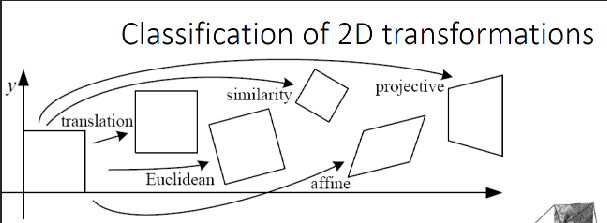

# 2D Image Transformations
**Course**: EE5178 — Modern Computer Vision

***

## Part 1: Foundations

### What is an Image?

An image is a **2D function** over space:
$$f(x, y)$$
- **Domain**: Spatial coordinates $(x, y)$
- **Range**: Intensity values
- **Interpretation**: A signal over space

### Types of Image Transformations

| Type | What Changes | Mathematical Form | Examples |
|---|---|---|---|
| **Filtering** | Pixel **values** (range) | $G(x) = h(F(x))$ | Blur, edge detection, sharpening |
| **Warping** | Pixel **locations** (domain) | $G(x) = F(h(x))$ | Rotation, scaling, perspective warp |

***

## Part 2: Linear 2D Transformations

### What Makes a Transformation "Linear"?

Linear transformations preserve two properties:
- **Origin** → $(0,0)$ always maps to $(0,0)$
- **Straight lines** → lines remain lines

**Formal Test** (both must hold):
$$F(x_1 + x_2) = F(x_1) + F(x_2) \qquad \text{(Additivity)}$$
$$F(\lambda x) = \lambda F(x) \qquad \text{(Scalar multiplication)}$$

All linear 2D transforms take the form:
$$x' = Ax \quad \text{where } A \text{ is a 2×2 matrix}$$

***

### Scaling

$$x' = s_x \cdot x, \qquad y' = s_y \cdot y$$

$$\begin{bmatrix} x' \\ y' \end{bmatrix} = \begin{bmatrix} s_x & 0 \\ 0 & s_y \end{bmatrix} \begin{bmatrix} x \\ y \end{bmatrix}$$

- **Uniform scaling**: $s_x = s_y$ → shape preserved
- **Non-uniform scaling**: $s_x \neq s_y$ → distortion

> **Eigenvalue Interpretation**: Eigenvectors = principal scaling axes; Eigenvalues = scaling factors along those axes

***

### Shear

Slants the shape — one coordinate shifts proportionally to the other.

**X-Shear** ($x$ shifts, $y$ unchanged):
$$x' = x + s_x \cdot y, \qquad y' = y$$
$$\begin{bmatrix} x' \\ y' \end{bmatrix} = \begin{bmatrix} 1 & s_x \\ 0 & 1 \end{bmatrix} \begin{bmatrix} x \\ y \end{bmatrix}$$

**Y-Shear** ($y$ shifts, $x$ unchanged):
$$x' = x, \qquad y' = y + s_y \cdot x$$
$$\begin{bmatrix} x' \\ y' \end{bmatrix} = \begin{bmatrix} 1 & 0 \\ s_y & 1 \end{bmatrix} \begin{bmatrix} x \\ y \end{bmatrix}$$

**Key Properties**:
- Distorts angles
- Preserves area (determinant = 1)
- Preserves parallelism of lines
- Effect scales with distance from origin

> **Deep Connection**: 2D translation in homogeneous coordinates is geometrically a **3D shear** along the $w$-axis. The entries $t_x, t_y$ in the translation matrix are performing a shear in projective $\mathbb{R}^3$ space that appears as a translation when projected back to $w=1$.

***

### Rotation

Rotates all points around the origin by angle $\theta$.

**Derivation** using polar coordinates ($x = r\cos\varphi$, $y = r\sin\varphi$):
$$x' = r\cos(\varphi + \theta) = x\cos\theta - y\sin\theta$$
$$y' = r\sin(\varphi + \theta) = x\sin\theta + y\cos\theta$$

$$\begin{bmatrix} x' \\ y' \end{bmatrix} = \begin{bmatrix} \cos\theta & -\sin\theta \\ \sin\theta & \cos\theta \end{bmatrix} \begin{bmatrix} x \\ y \end{bmatrix}$$

This is an **orthogonal matrix**: $\det = 1$, preserves distances and angles.

***

### All 2×2 Linear Transforms at a Glance

| Transform | Matrix |
|---|---|
| Scale | $\begin{bmatrix} s_x & 0 \\ 0 & s_y \end{bmatrix}$ |
| Rotate | $\begin{bmatrix} \cos\theta & -\sin\theta \\ \sin\theta & \cos\theta \end{bmatrix}$ |
| Shear | $\begin{bmatrix} 1 & s_x \\ s_y & 1 \end{bmatrix}$ |
| Flip across y | $\begin{bmatrix} -1 & 0 \\ 0 & 1 \end{bmatrix}$ |
| Flip across x | $\begin{bmatrix} 1 & 0 \\ 0 & -1 \end{bmatrix}$ |
| Flip across origin | $\begin{bmatrix} -1 & 0 \\ 0 & -1 \end{bmatrix}$ |
| Identity | $\begin{bmatrix} 1 & 0 \\ 0 & 1 \end{bmatrix}$ |

***

## Part 3: Why Translation is NOT Linear

**Translation**: $T(x) = x + t$ (shift every point by fixed offset $t$)

### Proof 1 — Fails Additivity

Pick $x_1 = 3$, $x_2 = 7$, $t = 5$:

$$T(x_1 + x_2) = T(10) = 10 + 5 = 15$$
$$T(x_1) + T(x_2) = (3+5) + (7+5) = 8 + 12 = 20$$
$$\therefore T(x_1 + x_2) \neq T(x_1) + T(x_2) \quad \text{❌}$$

Translating each point separately applies the shift **twice**; translating the sum only once. Formally: $T(x_1+x_2) = x_1+x_2+t$ but $T(x_1)+T(x_2) = x_1+x_2+2t$.

### Proof 2 — Fails Scalar Multiplication

Pick $x = 3$, $\lambda = 4$, $t = 5$:

$$T(\lambda x) = T(12) = 12 + 5 = 17$$
$$\lambda T(x) = 4 \times (3+5) = 32$$
$$\therefore T(\lambda x) \neq \lambda T(x) \quad \text{❌}$$

### Root Cause: Origin Moves

The deepest reason — every linear function must satisfy $F(0) = 0$. But:
$$T(0) = 0 + t = t \neq 0$$

Translation **moves the origin** → immediately disqualified from linearity.

### Why This is Inconvenient

Translation forces the *affine* form $x' = Ax + t$ — a $(A, t)$ pair instead of a single matrix. Composing two such transforms:

$$x'' = A_2(A_1 x + t_1) + t_2 = \underbrace{A_2 A_1}_{\text{clean}}\, x + \underbrace{A_2 t_1 + t_2}_{\text{coupled}}$$

Two asymmetric update rules: the new matrix is just $A_2 A_1$, but the new translation **mixes** $t_1$ with $A_2$ before adding $t_2$. You must track matrix and vector separately and apply different formulas to each — no longer a single matrix-multiplication machine. Homogeneous coordinates fix this by packing $(A, t)$ into one **3×3 matrix**, so ordinary matrix multiplication reproduces the coupled rule automatically.

***

## Part 4: Homogeneous Coordinates

### The Core Idea — Kernel Trick

Increase dimensionality so that the affine operation becomes **linear** in the higher-dimensional space. Embed 2D in 3D projective space by appending a $1$:

**Heterogeneous → Homogeneous**:
$$\begin{bmatrix} x \\ y \end{bmatrix} \rightarrow \begin{bmatrix} x \\ y \\ 1 \end{bmatrix}$$

**Homogeneous → Heterogeneous** (divide by $w$):
$$\begin{bmatrix} x \\ y \\ w \end{bmatrix} \rightarrow \begin{bmatrix} x/w \\ y/w \end{bmatrix}$$

### Scale Invariance

$(x, y, w) \sim (\lambda x, \lambda y, \lambda w)$ — all scalar multiples represent the **same 2D point**. A point in projective space is a **ray from the origin**, not a single vector.

### What is $w$?

- $w$ is a **scale factor**, not a spatial coordinate
- Affine transforms always leave $w = 1$ (bottom row stays $[0\ 0\ 1]$)
- Only **projective transforms** change $w$ → creates perspective effects
- In Euclidean space, a point is a vector; in projective space, a point is a **ray**

### General Homogeneous Transform Structure

$$\tilde{x}' = H\tilde{x}.$$

**Block form.** Partition $H$ into the linear $2\times 2$ block $A$, the translation column $t$, and the homogeneous row $[0\ 0\ 1]$:

$$
H \;=\; \left[\begin{array}{c|c} A & t \\ \hline \mathbf{0}^{\!\top} & 1 \end{array}\right] \;=\; \left[\begin{array}{cc|c} a & b & t_x \\ c & d & t_y \\ \hline 0 & 0 & 1 \end{array}\right].
$$

**Full transform:**

$$
\underbrace{\begin{bmatrix} x' \\ y' \\ 1 \end{bmatrix}}_{\tilde{x}'} \;=\; \underbrace{\left[\begin{array}{cc|c} a & b & t_x \\ c & d & t_y \\ \hline 0 & 0 & 1 \end{array}\right]}_{H} \underbrace{\begin{bmatrix} x \\ y \\ 1 \end{bmatrix}}_{\tilde{x}}.
$$

| Block | Symbol | Size | Role |
|---|---|---|---|
| Linear part | $A = \begin{bmatrix} a & b \\ c & d \end{bmatrix}$ | 2×2 | Rotation, scaling, shearing |
| Translation part | $t = \begin{bmatrix} t_x \\ t_y \end{bmatrix}$ | 2×1 | Shift in x and y |
| Homogeneous row | $[0\ 0\ 1]$ | 1×3 | Fixed for affine; free for projective |

***

## Part 5: All Transforms in 3×3 Homogeneous Form

**Translation**:
$$\begin{bmatrix} 1 & 0 & t_x \\ 0 & 1 & t_y \\ 0 & 0 & 1 \end{bmatrix}$$

**Scaling**:
$$\begin{bmatrix} s_x & 0 & 0 \\ 0 & s_y & 0 \\ 0 & 0 & 1 \end{bmatrix}$$

**Rotation**:
$$\begin{bmatrix} \cos\theta & -\sin\theta & 0 \\ \sin\theta & \cos\theta & 0 \\ 0 & 0 & 1 \end{bmatrix}$$

**Shear (combined XY)**:
$$\begin{bmatrix} 1 & s_x & 0 \\ s_y & 1 & 0 \\ 0 & 0 & 1 \end{bmatrix}$$

**Flip across y**:
$$\begin{bmatrix} -1 & 0 & 0 \\ 0 & 1 & 0 \\ 0 & 0 & 1 \end{bmatrix}$$

***

## Part 6: Matrix Composition

Transformations compose by **matrix multiplication**, applied **right-to-left**:
$$p' = M_n \cdots M_2 \cdot M_1 \cdot p$$

### Order Matters! ($M_1 M_2 \neq M_2 M_1$)

**Rotate then Translate** ($T \cdot R$):
$$T \cdot R = \begin{bmatrix} \cos\theta & -\sin\theta & t_x \\ \sin\theta & \cos\theta & t_y \\ 0 & 0 & 1 \end{bmatrix}$$

Translation applied in world coordinates after rotation.

**Translate then Rotate** ($R \cdot T$):
$$R \cdot T = \begin{bmatrix} \cos\theta & -\sin\theta & t_x\cos\theta - t_y\sin\theta \\ \sin\theta & \cos\theta & t_x\sin\theta + t_y\cos\theta \\ 0 & 0 & 1 \end{bmatrix}$$

The translation gets **rotated** — the object orbits the origin instead of rotating in place.

$$\therefore R \cdot T \neq T \cdot R$$

### When Does Composition Commute?

Composition is commutative only in these cases:

- **Translation ∘ Translation:** $T_1 T_2 = T_2 T_1$.
- **Rotation ∘ Rotation** (about the origin, i.e. all 2D rotations): $R_\alpha R_\beta = R_{\alpha+\beta} = R_\beta R_\alpha$.
- **Uniform Scaling ∘ Rotation:** $S_{\text{unif}} R = R S_{\text{unif}}$ (uniform scaling $= sI$ commutes with everything).
- **Uniform Scaling ∘ Uniform Scaling:** $S_{s_1} S_{s_2} = S_{s_1 s_2}$.

All other combinations are **non-commutative**.

### Standard SRT Order: Scale → Rotate → Translate

$$M = T \cdot R \cdot S$$

1. **Scale** around object's own origin
2. **Rotate** in place
3. **Translate** to world position

### Single Composed SRT Matrix

$$M = \begin{bmatrix} s_x\cos\theta & -s_y\sin\theta & t_x \\ s_x\sin\theta & s_y\cos\theta & t_y \\ 0 & 0 & 1 \end{bmatrix}$$

***

## Part 7: Classification of 2D Transformations



### Degrees of Freedom (DOF)

> **DOF = the number of independent parameters needed to uniquely represent the transformation**

**Rules**:
- Composing same family → DOF stays the same
- Composing different families → DOF jumps to the **higher family's DOF**
- DOF depends on the **final group** the result belongs to

### Transformation Hierarchy

```
All 2D Transformations
│
├── Linear (2×2 matrix, origin preserved)
│   ├── Scale          [DOF = 2]
│   ├── Rotation       [DOF = 1]
│   ├── Shear          [DOF = 2]
│   └── Flip/Reflect   [DOF = 0]
│
└── Affine & Beyond (3×3 homogeneous)
    │
    ├── Translation    [DOF = 2]    bottom row = [0 0 1]
    │       ↓ + Rotation
    ├── Euclidean      [DOF = 3]    bottom row = [0 0 1]
    │   (Rigid)                     preserves: distances, angles
    │       ↓ + Uniform Scale
    ├── Similarity     [DOF = 4]    bottom row = [0 0 1]
    │                               preserves: angles, ratios
    │       ↓ + Non-uniform Scale + Shear
    ├── Affine         [DOF = 6]    bottom row = [0 0 1]
    │                               preserves: lines, parallelism
    │       ↓ + Perspective warp (free bottom row)
    └── Projective     [DOF = 8]    bottom row = [g h i] (FREE)
        (Homography)                preserves: only lines
```

**Subset Hierarchy**:
$$\text{Translation} \subset \text{Euclidean} \subset \text{Similarity} \subset \text{Affine} \subset \text{Projective}$$

***

### 1. Translation — DOF = 2

$$\begin{bmatrix} 1 & 0 & t_x \\ 0 & 1 & t_y \\ 0 & 0 & 1 \end{bmatrix}$$

Free parameters: $t_x, t_y$

***

### 2. Euclidean (Rigid) — DOF = 3

Rotation + Translation

$$\begin{bmatrix} \cos\theta & -\sin\theta & t_x \\ \sin\theta & \cos\theta & t_y \\ 0 & 0 & 1 \end{bmatrix}$$

Free parameters: $\theta, t_x, t_y$ — **Preserves distances and angles**

***

### 3. Similarity — DOF = 4

Uniform Scaling + Rotation + Translation

$$\begin{bmatrix} s\cos\theta & -s\sin\theta & t_x \\ s\sin\theta & s\cos\theta & t_y \\ 0 & 0 & 1 \end{bmatrix}$$

Free parameters: $s, \theta, t_x, t_y$ — **Preserves angles but not distances**

***

### 4. Affine — DOF = 6

Arbitrary linear transformation (4 DOF) + Translation

$$\begin{bmatrix} a & b & t_x \\ c & d & t_y \\ 0 & 0 & 1 \end{bmatrix}$$

$$x' = ax + by + t_x, \qquad y' = cx + dy + t_y$$

Free parameters: $a, b, c, d, t_x, t_y$

**Properties**:
- Origin does NOT necessarily map to origin
- Lines → lines ✅
- Parallel lines stay parallel ✅
- Ratios of distances preserved ✅
- Compositions of affine transforms remain affine ✅
- Bottom row $[0\ 0\ 1]$ always fixed

***

### Why Going from Affine (6 DOF) to Similarity (4 DOF) Drops by **2**

The affine 2×2 block $\begin{bmatrix} a & b \\ c & d \end{bmatrix}$ has **4 free parameters**. Similarity forces this block into a **scaled rotation structure**:

$$A = s \cdot R = \begin{bmatrix} s\cos\theta & -s\sin\theta \\ s\sin\theta & s\cos\theta \end{bmatrix}$$

This simultaneously imposes **two constraints**:
- **Constraint 1**: $a = d$ (both are $s\cos\theta$)
- **Constraint 2**: $b = -c$ (off-diagonals are negatives)

These come as a **package** — you can't impose one without the other when you demand a scaled rotation. So all 4 entries $\{a, b, c, d\}$ become determined by just **2 numbers** ($s$ and $\theta$):

| | Affine | Similarity |
|---|---|---|
| $a$ | free | $= s\cos\theta$ |
| $b$ | free | $= -s\sin\theta$ |
| $c$ | free | $= +s\sin\theta$ |
| $d$ | free | $= s\cos\theta$ |
| **Free params in block** | **4** | **2** |

4 params → 2 params = **−2 DOF**. You go from having 4 independent knobs to just 2 knobs ($s$ and $\theta$).

***

### 5. Projective (Homography) — DOF = 8

Affine + Projective wraps

$$\begin{bmatrix} x' \\ y' \\ w' \end{bmatrix} = \begin{bmatrix} h_{11} & h_{12} & h_{13} \\ h_{21} & h_{22} & h_{23} \\ h_{31} & h_{32} & h_{33} \end{bmatrix} \begin{bmatrix} x \\ y \\ w \end{bmatrix}$$

Convert back: $\left(\frac{x'}{w'},\ \frac{y'}{w'}\right)$

**Why 8 DOF and not 9?**

The matrix is defined **up to scale** — multiplying every entry by scalar $k$ gives the **exact same transformation**. So one parameter is always redundant:
$$9\ \text{entries} - 1\ \text{(scale redundancy)} = \mathbf{8\ \text{DOF}}$$

In practice, fix $h_{33} = 1$ to eliminate this redundancy.

**Critical difference from Affine**: the bottom row $[h_{31}\ h_{32}\ h_{33}]$ is **free** — $w$ can change after transformation — this is what creates **perspective distortion**.

**Properties**:
- Origin does NOT necessarily map to origin
- Lines → lines ✅ (still true!)
- Parallel lines do NOT stay parallel ❌
- Ratios NOT preserved ❌
- Compositions of projective transforms remain projective ✅

**Geometric Meaning**: A camera at center point $O$ projects rays through plane $\pi'$ onto plane $\pi$. Every point on $\pi'$ maps to exactly one point on $\pi$ along the ray through $O$. Lines on $\pi'$ map to lines on $\pi$ because any plane through $O$ intersects both planes as lines.

***

## Part 8: Solving for Homography — Why 4 Points?

### Setting Up the System

Fix $h_{33} = 1$. **8 unknowns** remain. For a point correspondence $(x,y) \rightarrow (x', y')$:

$$x' = \frac{h_{11}x + h_{12}y + h_{13}}{h_{31}x + h_{32}y + 1}, \qquad y' = \frac{h_{21}x + h_{22}y + h_{23}}{h_{31}x + h_{32}y + 1}$$

Rearranging by multiplying both sides by the denominator:

$$\text{Eq 1:} \quad h_{11}x + h_{12}y + h_{13} - h_{31}x \cdot x' - h_{32}y \cdot x' = x'$$
$$\text{Eq 2:} \quad h_{21}x + h_{22}y + h_{23} - h_{31}x \cdot y' - h_{32}y \cdot y' = y'$$

**One point gives 2 equations** involving the 8 unknowns linearly.

### The Linear System

Stacking 4 point correspondences:
$$A_{8 \times 8} \cdot h_{8 \times 1} = b_{8 \times 1}$$

```
Point 1  →  Eq 1, Eq 2   ┐
Point 2  →  Eq 3, Eq 4   │  →  8×8 linear system  →  solve: h = A⁻¹b
Point 3  →  Eq 5, Eq 6   │
Point 4  →  Eq 7, Eq 8   ┘
```

$$4 \text{ points} \times 2 \text{ equations/point} = 8 \text{ equations} = 8 \text{ unknowns} \quad \checkmark$$

**Important**: No 3 of the 4 points can be **collinear** — otherwise rows become linearly dependent and the system has no unique solution.

***

## Part 9: Warping via Feature Matching

### Problem Setup

$$x_i' = f(x_i;\ p)$$

- $x_i$ = pixel coordinates in original image
- $x_i'$ = pixel coordinates in warped/target image
- $p$ = transformation parameters (8 for homography, 6 for affine)
- $f(\cdot;\ p)$ = transformation function

**Goal**: Find the best $p$ from matched feature correspondences.

### Optimization Formulation

$$\min_p \sum_i \|x_i' - f(x_i;\ p)\|^2$$

This is **least squares minimization** — find parameters $p$ that minimize total prediction error across all matched pairs. The features are the **evidence**; $p$ is the **hypothesis** being fit.

### Full Pipeline

```
Original image  →  Detect features {xᵢ}   [SIFT, ORB, ...]
Warped image    →  Detect features {xⱼ'}
        ↓
Match:    for each xᵢ, nearest-neighbour over {xⱼ'} by L₂ descriptor distance
          keep pair iff Lowe ratio  d₁ / d₂ < 0.8        →  correspondences (xᵢ, xᵢ')
        ↓
Solve:    p̂ = argmin_p  Σᵢ ‖ xᵢ' − f(xᵢ; p) ‖²        (closed-form / DLT + RANSAC)
        ↓
Output:   transformation matrix H (or M)
```

### Points Needed

| Transform | DOF | Min. correspondences |
|---|---|---|
| Affine | 6 | 3 points |
| Homography | 8 | 4 points |

Use **RANSAC** to robustly discard outlier matches.

### Applications

- **Image Stitching / Panoramas** — solve homography between overlapping frames
- **SLAM** — estimate camera pose frame-to-frame via feature matching
- **Document Scanning** — unwarp perspective-distorted photos
- **Face Alignment** — align facial landmarks for recognition

***

## Part 10: Master Summary Table

| Transform | Matrix | DOF | Preserves | Violates | Bottom Row |
|---|---|---|---|---|---|
| Linear (origin-fixed) | $\begin{bmatrix}a&b&0\\c&d&0\\0&0&1\end{bmatrix}$ | 4 | **Origin** $(0,0)\!\to\!(0,0)$, lines, parallelism, ratios on the same line | Distances, angles, areas, orientation (if $\det A < 0$) | $[0\ 0\ 1]$ fixed |
| Translation | $\begin{bmatrix}1&0&t_x\\0&1&t_y\\0&0&1\end{bmatrix}$ | 2 | **Distances, angles, areas, parallelism, orientation**, lines | Absolute position only | $[0\ 0\ 1]$ fixed |
| Euclidean (Rigid) | $\begin{bmatrix}\cos\theta&-\sin\theta&t_x\\\sin\theta&\cos\theta&t_y\\0&0&1\end{bmatrix}$ | 3 | **Distances, angles, areas, parallelism, orientation**, lines | Absolute position & absolute orientation only | $[0\ 0\ 1]$ fixed |
| Similarity | $\begin{bmatrix}s\cos\theta&-s\sin\theta&t_x\\s\sin\theta&s\cos\theta&t_y\\0&0&1\end{bmatrix}$ | 4 | **Angles, ratios of distances** (any pair), parallelism, lines | Absolute distances, absolute areas | $[0\ 0\ 1]$ fixed |
| Affine | $\begin{bmatrix}a&b&t_x\\c&d&t_y\\0&0&1\end{bmatrix}$ | 6 | **Parallelism, ratios on the same line** (midpoints), ratios of areas, lines | Distances, angles, distance ratios between non-collinear pairs | $[0\ 0\ 1]$ fixed |
| Projective (Homography) | $\begin{bmatrix}a&b&c\\d&e&f\\g&h&i\end{bmatrix}$ | 8 | **Lines, cross-ratio** of 4 collinear points | Parallelism, midpoints, ratios of areas, distances, angles | $[g\ h\ i]$ **free** |

Properties weaken monotonically down the table: each row preserves a strict *subset* of the row above's invariants (e.g. Similarity drops *absolute* distances but keeps their ratios; Affine drops angles and same-pair distance ratios but keeps the same-line ones; Projective drops parallelism but keeps collinearity).

***

## Key Takeaways

1. **Filtering** changes pixel values; **warping** changes pixel locations
2. **Linear transforms** (scale, rotate, shear) all preserve origin — expressible as 2×2 matrices
3. **Translation is NOT linear** — it moves the origin, violating both additivity and scalar multiplication
4. **Homogeneous coordinates** embed 2D in 3D (append $w=1$), making translation linear in the 3×3 framework
5. **Matrix multiplication order matters** — $T \cdot R \neq R \cdot T$; standard order is Scale → Rotate → Translate
6. **DOF hierarchy**: Translation (2) ⊂ Euclidean (3) ⊂ Similarity (4) ⊂ Affine (6) ⊂ Projective (8)
7. **Affine preserves parallelism**; bottom row is always $[0\ 0\ 1]$; 6 DOF
8. **Homography allows perspective**; bottom row is free; 9 entries − 1 (scale) = **8 DOF**
9. **4 point correspondences** uniquely solve homography: $4 \times 2 = 8$ equations for 8 unknowns
10. **Warping parameters are learned** via $\min_p \sum \|x_i' - f(x_i;p)\|^2$ — backbone of stitching and SLAM