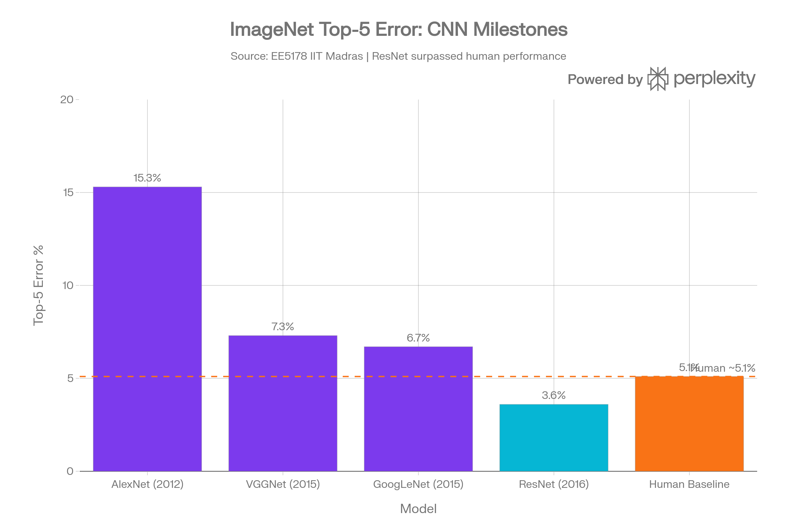
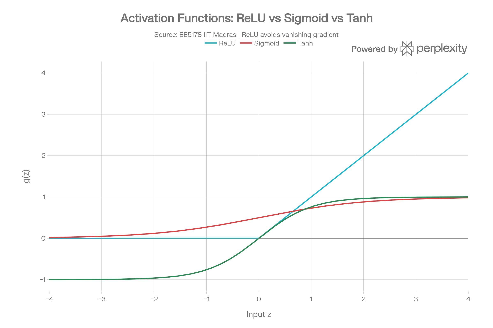

Here are comprehensive, cohesive notes synthesising everything from the full conversation — the two lecture slides, the pipeline comparison, and the compositional abstraction explanation.

***

# Deep Learning — Comprehensive Notes
*EE5178 — Modern Computer Vision | Prof. Kaushik Mitra, IIT Madras*
*Slide credit: Yoshua Bengio & Yann LeCun*

***

## 1. Machine Learning: The Big Picture

**Goal:** Learn from data with minimal human intervention.

| Paradigm | What's Given | What's Learned | Examples |
|---|---|---|---|
| **Supervised** | Input-output pairs $(x_i, y_i)$ | A mapping $f: x \to y$ | Image classification, object detection |
| **Unsupervised** | Data $x$ only | Underlying structure | Clustering, dimensionality reduction |

> **Scale intuition:** A 64×64 binary image has $2^{64 \times 64} \approx 10^{1000}$ possible configurations — natural images occupy a vanishingly small, structured subspace within this.

***

## 2. Traditional Pipelines — What They Are and What They Lack

Traditional CV/ML pipelines work as follows:

```
Input → Hand-crafted features (SIFT/HOG) [fixed] → Classifier [learned] → Output
```

This pattern appears across domains:
- **Vision:** HOG/SIFT → classifier → "car"
- **Speech:** MFCC features → classifier → phoneme
- **NLP:** Bag-of-Words → classifier → sentiment

### The Core Problem: Compositional Feature Abstraction is Missing

This is the single most important failure of traditional approaches, and it has two parts:

**"Abstraction"** means representing data at progressively higher, more general levels:
- Level 1: Raw pixels → oriented edges
- Level 2: Edges → corners, curves, textures
- Level 3: Textures + curves → object parts (wheels, eyes)
- Level 4: Parts → full objects (car, face)

**"Compositionality"** means higher-level concepts are *built from* simpler ones — a wheel is composed of curves, a car is composed of wheels, doors, and windows, all the way up from pixels.

**Why traditional methods lack this:**
- SIFT/HOG describe local pixel gradients at a *single fixed scale* — they don't stack
- Features are **manually designed** by humans, not discovered from data
- The feature extractor and classifier are **decoupled** — only the classifier trains; features never adapt to the task
- There is no mechanism to say *"I'm detecting cars — let me focus on circular edge combinations that form wheels"*

> **Analogy:** Describing a symphony using only raw note frequencies — you'd miss the chords, melodies, and movements. Compositionality is the ability to perceive *structure*, not just raw signals.

***

## 3. Deep Learning: The Three Key Ideas

### a. Hierarchical Compositionality
- A **cascade of nonlinear functions** stacked sequentially
- Each layer builds increasingly abstract representations from the previous layer's output:
  - **Low-level:** Gabor-like oriented edge filters, colour blobs
  - **Mid-level:** Combinations of edges — textures, curves, angles, object parts
  - **High-level:** Complex part detectors — faces, wheels, eyes, body parts
- Simple patterns **compose** into complex, semantic concepts

### b. End-to-End Learning
- The entire pipeline — raw pixels to output label — is **jointly optimised**
- Representations are **task-driven**: the network learns *what features are useful*, not what a human thinks is useful
- No manual feature engineering; the model **learns to extract features** itself

### c. Distributed Representation
- **No single neuron encodes one concept entirely**
- Groups of neurons work together to represent information
- Enables generalisation and sharing of structure across concepts

### Pipeline Contrast

| Stage | Traditional | Deep Learning |
|---|---|---|
| Feature extraction | Hand-crafted (SIFT, HOG) | Learned automatically |
| Training scope | Classifier only | All stages jointly |
| Feature hierarchy | None — flat, single level | Low → Mid → High level |
| Adaptability | Fixed, task-independent | Task-driven |
| Coupling | Decoupled | End-to-end |

***

## 4. ImageNet Milestones

Deep learning drove a dramatic reduction in ImageNet Top-5 error, eventually **surpassing human performance (~5.1%)** with ResNet in 2016:



| Model | Year | Top-5 Error | Layers | Key Contribution |
|---|---|---|---|---|
| LeNet | 1998 | — (MNIST) | 7 | First CNN for digits |
| AlexNet | NIPS 2012 | 15.3% | 8 | GPU training, ReLU, Dropout |
| VGGNet | ICLR 2015 | 7.3% | 16–19 | Very deep, small 3×3 filters |
| GoogLeNet | CVPR 2015 | 6.7% | 22 | Inception modules |
| **ResNet** | **CVPR 2016** | **3.6%** | **152** | **Residual connections (skip connections)** |

***

## 5. Deep Learning Application Map

| Task | Key Papers |
|---|---|
| **Object Detection** | OverFeat (ICLR 2014), R-CNN (CVPR 2014), Fast/Faster R-CNN (NeurIPS 2015), YOLO (2015), YOLO9000 (CVPR 2017) |
| **Image Segmentation** | FCN (CVPR 2015), DeepLab (2015), CRFs as RNNs (ICCV 2015) |
| **Style Transfer** | Neural Style Transfer — Gatys et al. (CVPR 2016), Deep Photo Style Transfer — Luan et al. (CVPR 2017) |
| **Image Translation** | Pix2Pix — Isola et al. (CVPR 2017) — conditional GAN: sketch→photo, day→night |
| **Image/Audio Generation** | PixelRNN/CNN (ICML 2016 Best Paper), DCGAN (ICLR 2016), WaveNet — DeepMind (2016) |

***

## 6. Biological Motivation: The McCulloch-Pitts Neuron (1943)

Inspired by biological neurons:
- **Dendrites** → inputs
- **Soma/nucleus** → weighted summation
- **Axon** → output (fires or doesn't)

**Mathematical model:** Fires when weighted input exceeds threshold $\mu$:

$$\sum_{i=1}^{n} w_i x_i > \mu \implies \text{output} = 1$$

**Example:** With $w_1 = +1,\, w_2 = +1,\, w_3 = -1$ and appropriate $\mu$, this implements a **NOR gate** — showing early neurons could compute logical functions.

***

## 7. Rosenblatt's Perceptron (1953)

The **Mark 1 Perceptron** was a physical hardware machine built for digit recognition — the direct precursor to modern neural networks.

**Geometrical interpretation:** A perceptron computes a **linear decision boundary**:

$$w_1 x_1 + w_2 x_2 > \mu \quad \Rightarrow \quad \text{half-plane boundary in 2D}$$

> **Key result:** A perceptron can compute *any* **linearly separable** function.

### The XOR Problem — Perceptron's Fatal Limitation

| $x_1$ | $x_2$ | XOR |
|---|---|---|
| 0 | 0 | 0 |
| 0 | 1 | 1 |
| 1 | 0 | 1 |
| 1 | 1 | 0 |

The four XOR points cannot be separated by any single straight line — the data is **not linearly separable**. A single perceptron fundamentally **cannot** learn XOR.

***

## 8. Multi-Layer Perceptron (MLP): Solving XOR

**Solution:** Add a hidden layer with a **non-linear activation function**.

**Two-layer network:**
$$h = f^{(1)}(x;\, W, b) = g(Wx + b)$$
$$y = f^{(2)}(h;\, U, c) = U^T h + c$$

### Why Non-Linearity is Essential

If $f^{(1)}$ is linear:
$$y = U^T(Wx) = W'x$$
This is still just a linear function — depth without non-linearity provides *zero* additional expressive power. The activation function **must** be non-linear to learn useful features.

### ReLU — Rectified Linear Unit

$$g(z) = \max\{0, z\}$$

- Zero for $z < 0$, linear slope for $z > 0$
- Simple, computationally fast
- Avoids vanishing gradient — the dominant reason ReLU became the default

**XOR solution:** With specifically chosen weights:
$$W = \begin{bmatrix}1 & 1\\1 & 1\end{bmatrix},\quad b = \begin{bmatrix}0\\-1\end{bmatrix},\quad U = \begin{bmatrix}1\\-2\end{bmatrix},\quad c = 0$$

$$y = U^T \max\{0, Wx + b\} + c$$

The ReLU non-linearity **transforms the input into a new feature space** where XOR *is* linearly separable — this is the essence of what hidden layers do.

### Universal Approximation Theorem

> A neural network with even a single hidden layer can approximate *any* continuous function, given appropriate parameters.

However: **depth (more layers) beats width (more neurons per layer)**. Deeper networks can represent compositional hierarchies exponentially more efficiently than shallow wide ones.

***

## 9. Activation Functions



| Activation | Formula | Output Range | Key Properties |
|---|---|---|---|
| **ReLU** | $\max\{0, z\}$ | $[0, \infty)$ | Fast, sparse, avoids vanishing gradient — **default choice** |
| **Sigmoid** | $\dfrac{1}{1+e^{-z}}$ | $(0, 1)$ | Saturates at extremes → vanishing gradient; use only at output for binary classification |
| **Tanh** | $2\sigma(2z) - 1$ | $(-1, 1)$ | Zero-centred; still saturates; preferred over sigmoid for hidden layers when needed |

> Activation function choice is a **critical design decision** — it determines what the network can and cannot represent.

***

## 10. Output Units by Task

| Task | Output Activation | Why |
|---|---|---|
| **Regression** | Linear: $\hat{y} = Wh + b$ | Unbounded real-valued output needed |
| **Binary classification** | Sigmoid: $\hat{y} = \sigma(w^T h + b)$ | Squashes output to valid probability $\in (0,1)$ |
| **Multi-class (K classes)** | Softmax: $\dfrac{e^{z_k}}{\sum_j e^{z_j}}$ | Outputs sum to 1 across all K classes — valid probability distribution |

**Why not K independent sigmoids for multi-class?** Each sigmoid outputs independently — the K values don't constrain to sum to 1, so they cannot represent a valid probability distribution over classes.

***

## 11. Loss / Cost Functions

### Regression — Mean Squared Error (MSE)

$$J(\theta) = \frac{1}{2} \sum_{\{x_i, y_i\}} \|y_i - f(x_i, \theta)\|^2$$

Penalises the squared deviation between prediction and target.

### Classification — Cross-Entropy

Minimising **KL divergence** between the true distribution $p$ and predicted distribution $q$:

$$D_{KL}(p \| q) = \sum_x p(x) \ln \frac{p(x)}{q(x)} = \underbrace{-H(p)}_{\text{constant w.r.t. } \theta} + H(p, q)$$

Since entropy $H(p)$ is constant with respect to $\theta$, **minimising KL divergence = minimising cross-entropy**:

$$\boxed{J(\theta) = \sum_{x_i, y_i} H\big(p(x_i),\, q(x_i)\big)}$$

***

## 12. MLP Design Checklist

To fully specify an MLP, choose:

1. **Architecture** — number of hidden layers and number of units per layer
2. **Hidden layer activation** — ReLU (default), sigmoid, or tanh
3. **Output layer activation** — linear (regression), sigmoid (binary classification), softmax (multi-class)
4. **Loss function** — MSE (regression), cross-entropy (classification)

***

## 13. Course Roadmap: Neural Networks

1. McCulloch-Pitts model
2. Rosenblatt's Perceptron
3. Geometry and linear separability
4. XOR problem → need for hidden layers
5. Multi-Layer Perceptron (MLP)
6. Training MLPs
7. **Error Back-Propagation** ← next topic
8. Loss functions

***

## Key Takeaways

- Traditional pipelines **fix features manually** and train only the classifier — they lack the ability to build complex concepts from simpler ones (compositional feature abstraction)
- Deep learning solves this with **three principles**: hierarchical compositionality, end-to-end learning, and distributed representation
- A single perceptron is limited to linear boundaries; **hidden layers + non-linear activations** overcome this — ReLU being the standard choice
- The XOR problem motivates the MLP: non-linearity in hidden layers **transforms data into a linearly separable space**
- Output layer design follows the task: **softmax + cross-entropy** for classification, **linear + MSE** for regression
- **Depth > width**: composing multiple layers enables exponentially richer representations, mirroring how humans perceive the world — from edges, to shapes, to objects