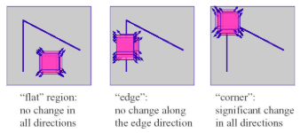
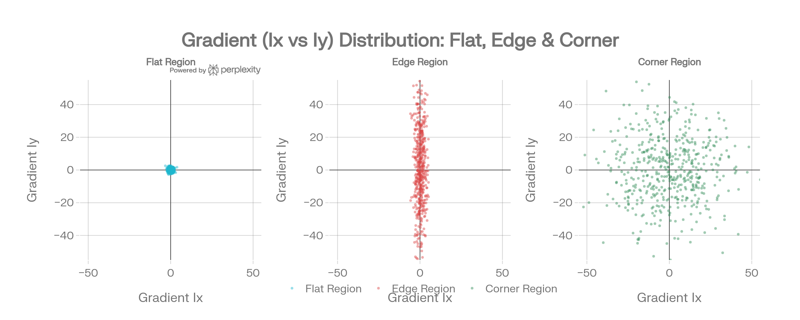
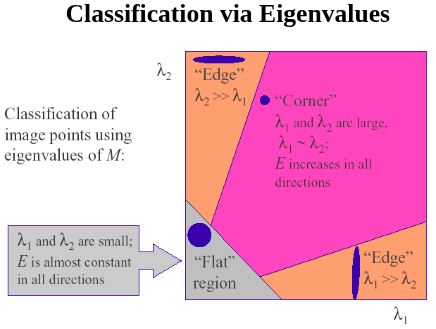

# Harris Corner Detector

*EE5178 — Modern Computer Vision*

---

## 1. Motivation

Many core vision tasks — **stereo reconstruction**, **motion estimation**, **image stitching**, and **object recognition** — reduce to finding **corresponding features** across two or more views. The basic strategy is to match small image patches of fixed size between frames, which is reliable only if the patch is *uniquely identifiable* in the other frame.

- **Good patch.** Distinctive texture (e.g., a corner) — only *one* matching patch exists in the target image.
- **Bad patch.** A uniform region or a single straight edge — *many* patches look similar, leaving the correspondence ambiguous.

A corner detector seeks the rare image locations whose local appearance is robust enough to act as anchors for matching.

---

## 2. What Is a Corner?

### 2.1 Geometric Definition

A **corner** is a point where two or more image contours (edges) meet — equivalently, a point whose local neighbourhood exhibits **significant intensity variation in every direction**. Sliding a small window at a corner produces a large appearance change *no matter which direction the shift occurs in*.

### 2.2 Three Types of Local Regions

| Region | Window Response | Gradient Scatter Shape |
|---|---|---|
| **Flat** | No change in any direction | Tight dot at origin |
| **Edge** | Change only perpendicular to edge | Elongated ellipse along one axis |
| **Corner** | Large change in **all** directions | Broad, near-isotropic blob |

Corners are preferred features because they are **stable across viewpoint changes**, **uniquely localisable**, and consequently **easy to match** between frames.

---

## 3. Quantifying Local Variation — The SSD Error

To turn the geometric notion above into a measurable quantity, define the **sum-of-squared-differences (SSD)** error of shifting a window by $(u, v)$:

$$E(u, v) \;=\; \sum_{x, y} \underbrace{w(x, y)}_{\text{window function}}\, \bigl[\, \underbrace{I(x + u,\, y + v)}_{\text{shifted intensity}} - \underbrace{I(x, y)}_{\text{intensity}} \,\bigr]^2.$$

The **window function** $w(x, y)$ comes in two standard forms:

- **Rectangular box** — the simplest case, $w(x, y) = 1$ inside the window and $0$ outside (a hard top-hat).
- **Gaussian** $G_\sigma$ — smooth roll-off, downweights distant pixels; preferred in practice because it makes $E(u, v)$ rotationally smoother and less sensitive to the window boundary.

A patch is **corner-like** iff $E(u, v)$ is large for *every* shift direction. The three regimes therefore behave as follows: a **flat** region produces $E \approx 0$ for all shifts; an **edge** produces $E \approx 0$ for shifts *along* the edge direction (and large $E$ only across it); a **corner** produces large $E$ in every direction.

Direct evaluation of $E(u, v)$ for many candidate $(u, v)$ is expensive; the next step linearises it.

---

## 4. First-Order Approximation

### 4.1 2D Taylor Expansion

For a smooth $f$, the full 2D Taylor expansion of a shifted value is

$$f(x + u,\, y + v) \;=\; f(x, y) + u\, f_x + v\, f_y + \tfrac{1}{2!}\!\left[\, u^2 f_{xx} + 2 u v\, f_{xy} + v^2 f_{yy} \,\right] + \cdots$$

### 4.2 Small-Motion Assumption

For sufficiently small shifts $(u, v)$ we discard quadratic and higher terms — the **small-motion (linearisation) assumption**:

$$I(x + u,\, y + v) \;\approx\; I(x, y) + u\, I_x + v\, I_y.$$

### 4.3 Quadratic Form for the SSD

Substituting back into $E(u, v)$ — the $I(x, y)$ terms cancel:

$$E(u, v) \;\approx\; \sum_{x, y} w(x, y)\, \bigl[\, u\, I_x + v\, I_y \,\bigr]^2 \;=\; \sum_{x, y} w(x, y)\,\bigl[\, u^2 I_x^2 + 2 u v\, I_x I_y + v^2 I_y^2 \,\bigr].$$

The SSD is therefore a **quadratic form in $(u, v)$**, which we now write in matrix notation.

---

## 5. The Structure Tensor (Second-Moment Matrix)

### 5.1 Bilinear Form

Factor the quadratic form of §4.3:

$$E(u, v) \;\approx\; \begin{bmatrix} u & v \end{bmatrix} M \begin{bmatrix} u \\ v \end{bmatrix},$$

where $M$ is the **$2 \times 2$ structure tensor** (a.k.a. *second-moment matrix* or *autocorrelation matrix*):

$$M \;=\; \sum_{x, y} w(x, y) \begin{bmatrix} I_x^2 & I_x I_y \\ I_x I_y & I_y^2 \end{bmatrix} \;=\; \begin{bmatrix} S_{x^2} & S_{xy} \\ S_{xy} & S_{y^2} \end{bmatrix}.$$

> **Important.** The entries $I_x^2$, $I_x I_y$, $I_y^2$ are **pointwise products of the first-order gradient components** $I_x, I_y$ — *not* second derivatives. In particular, $M$ is **not** the Hessian of $I$; despite the suggestive notation, $I_x^2 \neq \partial^2 I / \partial x^2$.

The simplest choice $w(x, y) = 1$ (a uniform box) reduces the outer sum to an unweighted local sum; in practice $w$ is taken to be a Gaussian, as discussed below.

Here the gradient images are themselves obtained by **convolving the input with derivative-of-Gaussian filters**,

$$I_x \;=\; \partial_x G_{\sigma_D} \ast I, \qquad I_y \;=\; \partial_y G_{\sigma_D} \ast I,$$

and the window weight $w(x, y)$ in the outer sum **is itself a Gaussian** $G_{\sigma_I}$ (the *integration window*, §7.4) — so the sum $\sum_{x, y} w(x, y)\, (\cdot)$ is exactly a convolution with $G_{\sigma_I}$.

The three independent entries are therefore computed in two stages:

1. **Hadamard (elementwise) products** of the gradient images: $I_x^2 = I_x \circ I_x$, $I_y^2 = I_y \circ I_y$, $I_{xy} = I_x \circ I_y$ (*not* matrix multiplication).
2. **Gaussian-weighted summation** — i.e. the window $w$ — over a neighbourhood: $S_{x^2} = G_{\sigma_I} \ast I_x^2$, $S_{y^2} = G_{\sigma_I} \ast I_y^2$, $S_{xy} = G_{\sigma_I} \ast I_{xy}$.

### 5.2 The Gradient Scatter Ellipse

Each pixel in the window contributes a point $(I_x, I_y)$ to a 2D scatter plot. The shape of this cloud is characterised by fitting a **principal-component ellipse** — its axes are the eigenvectors of $M$, and its radii are $\sqrt{\lambda_1}, \sqrt{\lambda_2}$:

- **Flat.** Tiny circular cluster near origin $\Rightarrow$ both $\lambda$ small.
- **Edge.** Elongated ellipse along one axis $\Rightarrow$ one $\lambda$ large, one small.
- **Corner.** Large circular / isotropic blob $\Rightarrow$ both $\lambda$ large.

This geometric picture is the intuitive bridge between the gradient images and the algebraic corner response $R$.

### 5.3 Eigenvalue-Based Region Classification

| $\lambda_1, \lambda_2$ | Scatter Cloud | SSD Level Set | Region |
|---|---|---|---|
| Both $\approx 0$ | Tiny cluster at origin | (Degenerate) | **Flat** |
| $\lambda_1 \gg 0,\ \lambda_2 \approx 0$ | Elongated 1D ridge | Long thin ellipse | **Edge** |
| Both large | Broad, near-isotropic blob | Compact ellipse | **Corner** ✅ |

This geometric picture is the bridge between the gradient images and the algebraic corner response $R$ defined next.

---

## 6. The Harris Corner Response $R$

### 6.1 Definition

Explicit eigen-decomposition is expensive. Harris & Stephens (1988) introduced an algebraic surrogate computed from the trace and determinant of $M$:

$$\boxed{\; R \;=\; \det(M) - k\,\bigl(\mathrm{tr}\, M\bigr)^2, \qquad k \in [0.04,\, 0.06]. \;}$$

Using the identities

$$\det(M) \;=\; \lambda_1 \lambda_2 \;=\; S_{x^2}\, S_{y^2} - S_{xy}^2, \qquad \mathrm{tr}(M) \;=\; \lambda_1 + \lambda_2 \;=\; S_{x^2} + S_{y^2},$$

$R$ is a function of the eigenvalues alone, so it inherits all rotation/translation invariances of the spectrum without requiring an actual eigenvalue solve.

### 6.2 Why $\det(M) - k\,\mathrm{tr}(M)^2$ Works

Substitute $\lambda_1, \lambda_2$ into the definition:

$$R \;=\; \lambda_1 \lambda_2 \;-\; k\,(\lambda_1 + \lambda_2)^2.$$

Now examine the three regimes:

- **Edge** ($\lambda_1 \gg 0$, $\lambda_2 \approx 0$): $\det \approx 0$, $\mathrm{tr}^2 \approx \lambda_1^2$, so $R \approx -k\, \lambda_1^2$ — large **negative**. The determinant *kills* one-direction-only structure, exposing the trace's large square as a penalty.
- **Corner** ($\lambda_1 \approx \lambda_2 = \lambda$, both large): $\det \approx \lambda^2$, $\mathrm{tr}^2 \approx 4 \lambda^2$, so $R \approx (1 - 4k)\, \lambda^2$ — large **positive** for any $k < 0.25$.
- **Flat** ($\lambda_1, \lambda_2 \approx 0$): both terms vanish, so $R \approx 0$.

The choice $k \in [0.04, 0.06]$ keeps the corner score well above zero while making the penalty on edges severe.

### 6.3 Region Classification by Sign of $R$

| $R$ value | Verdict | Eigenvalue Pattern |
|---|---|---|
| $R \gg 0$ | **Corner** — $\det(M)$ dominates | Both $\lambda$ large |
| $R \ll 0$ | **Edge** — trace term dominates | One $\lambda$ large, the other $\approx 0$ |
| $\lvert R \rvert \approx 0$ | **Flat** | Both $\lambda$ small |

---

## 7. Full Algorithm Pipeline

### 7.1 Step 1 — Pre-Smooth (Differentiation Scale $\sigma_D$)

The gradient image is obtained by a single convolution with a **derivative-of-Gaussian (DoG) filter**:

$$I_x(x, y) \;=\; \bigl(\partial_x G_{\sigma_D}\bigr) \ast I, \qquad \partial_x G_{\sigma_D}(x, y) \;=\; -\frac{x}{\sigma_D^2} \cdot \frac{1}{2\pi\sigma_D^2}\, e^{-(x^2 + y^2) / 2\sigma_D^2},$$

and symmetrically for $I_y$. By the derivative theorem of convolution this is equivalent to **smooth-then-differentiate**:

$$I_x \;=\; \bigl(\partial_x G_{\sigma_D}\bigr) \ast I \;=\; \partial_x \bigl(G_{\sigma_D} \ast I\bigr).$$

Smoothing first suppresses pixel-level noise so it is not amplified by the subsequent derivative (cf. Edge Detection notes §6). A larger $\sigma_D$ gives coarser but more stable gradients.

### 7.2 Step 2 — Sobel Gradients (Discrete Approximation of $\partial_x G_{\sigma_D}$)

In practice the analytical kernel $\partial_x G_{\sigma_D}$ is replaced by the $3 \times 3$ **Sobel kernels**, which are the cheapest discrete approximation of a smoothed derivative:

$$K_x = \begin{bmatrix} -1 & 0 & 1 \\ -2 & 0 & 2 \\ -1 & 0 & 1 \end{bmatrix}, \qquad K_y = \begin{bmatrix} -1 & -2 & -1 \\ 0 & 0 & 0 \\ 1 & 2 & 1 \end{bmatrix}, \qquad I_x = K_x \ast I, \qquad I_y = K_y \ast I.$$

**Separability — why Sobel is a smoothed derivative.** Each Sobel kernel factorises into an outer product of a 1D *smoother* and a 1D *differentiator*:

$$K_x \;=\; \underbrace{\begin{bmatrix} 1 \\ 2 \\ 1 \end{bmatrix}}_{\text{smooth ($y$-dir)}} \;\otimes\; \underbrace{\begin{bmatrix} -1 & 0 & +1 \end{bmatrix}}_{\text{differentiate ($x$-dir)}}, \qquad K_y \;=\; \underbrace{\begin{bmatrix} -1 \\ 0 \\ +1 \end{bmatrix}}_{\text{differentiate ($y$-dir)}} \;\otimes\; \underbrace{\begin{bmatrix} 1 & 2 & 1 \end{bmatrix}}_{\text{smooth ($x$-dir)}}.$$

The $[1, 2, 1]$ row/column is a discrete Gaussian of approximate width $\sigma_D \!\approx\! 1$, and $[-1, 0, +1]$ is the central-difference derivative. Sobel therefore *embeds* a small amount of smoothing inside the gradient computation — it is itself a (low-resolution) DoG filter:

$$K_x \;\approx\; \partial_x G_{\sigma_D \approx 1}.$$

$K_x$ fires on **vertical edges** (horizontal intensity change); $K_y$ fires on **horizontal edges**.

**Summary of the relationship** between the four objects of §7.1–§7.2:

$$I \;\xrightarrow{\;\partial_x G_{\sigma_D}\,\ast\;}\; I_x \quad\Longleftrightarrow\quad I \;\xrightarrow{\;K_x\,\ast\;}\; I_x \qquad \text{(Sobel = discrete approx. of } \partial_x G_{\sigma_D}\text{).}$$

### 7.3 Step 3 — Gradient Products (Hadamard)

From the gradient images $I_x, I_y$ produced above, form the three pointwise products that populate the structure tensor:

$$I_{x^2} = I_x \circ I_x, \qquad I_{y^2} = I_y \circ I_y, \qquad I_{xy} = I_x \circ I_y.$$

Elementwise operations — $O(mn)$, far cheaper than any matrix product.

### 7.4 Step 4 — Aggregation (Integration Scale $\sigma_I$)

$$S_{x^2} = G_{\sigma_I} \ast I_{x^2}, \qquad S_{y^2} = G_{\sigma_I} \ast I_{y^2}, \qquad S_{xy} = G_{\sigma_I} \ast I_{xy}.$$

The Gaussian window **aggregates neighbourhood evidence** into the structure tensor. The centre pixel receives the highest weight (e.g. 0.2042 for $\sigma = 1$), corner pixels the least (e.g. 0.0751).

### 7.5 Step 5 — Build the Structure Tensor

$$M(x, y) \;=\; \begin{bmatrix} S_{x^2}(x, y) & S_{xy}(x, y) \\ S_{xy}(x, y) & S_{y^2}(x, y) \end{bmatrix}.$$

### 7.6 Step 6 — Response, Threshold, NMS

$$R(x, y) \;=\; \det\bigl(M(x, y)\bigr) - k\,\bigl(\mathrm{tr}\, M(x, y)\bigr)^2.$$

Threshold on $R$ to retain candidate corners, then apply **Non-Maximum Suppression** — keep only local maxima of $R$ within a neighbourhood — to thin detections to a single pixel per corner.

### 7.7 Why Two Different Smoothings?

| Parameter | Symbol | Typical $\sigma$ | Purpose |
|---|---|---|---|
| **Differentiation scale** | $\sigma_D$ | small (≈0.5–1.0) | Pre-smooth the image to suppress noise *before* differentiation. |
| **Integration scale** | $\sigma_I$ | larger (≈1.5–2.0) | Gaussian window that aggregates gradient energy into the structure tensor. |

The two scales play **distinct roles** — $\sigma_D$ prepares the image, $\sigma_I$ summarises a neighbourhood. The standard relationship is $\sigma_I = \gamma\, \sigma_D$ with $\gamma \approx 1.5\text{–2}$.

---

## 8. Worked Numerical Example

Three synthetic $7 \times 7$ patches with $k = 0.04$:

| Quantity | Flat | Edge | Corner |
|---|---|---|---|
| Patch | Uniform $\approx 101$ | Dark left / bright right | Dark top-left / bright bottom-right |
| After $\sigma_D$-smoothing | Uniform | Smooth ramp in $x$ only | Smooth ramp in **both** $x$ and $y$ |
| $I_x$ | $\approx 0$ | **Large** ($\approx 552$) | **Large** ($\approx 376$) |
| $I_y$ | $\approx 0$ | $\approx 0$ | **Large** ($\approx 376$) |
| $S_{x^2}$ | $0.18$ | $232{,}722$ | $110{,}691$ |
| $S_{y^2}$ | $0.40$ | $\mathbf{0.00}$ | $110{,}691$ |
| $S_{xy}$ | $0.07$ | $0.00$ | $73{,}564$ |
| $\det(M)$ | $0.07$ | $\mathbf{0.00}$ | $\mathbf{6.84 \times 10^{9}}$ |
| $\mathrm{tr}(M)$ | $0.58$ | $232{,}722$ | $221{,}382$ |
| $R$ | $\mathbf{+0.05}$ | $\mathbf{-2.17 \times 10^{9}}$ | $\mathbf{+4.88 \times 10^{9}}$ |
| **Verdict** | ⬜ Flat | ❌ Edge | ✅ Corner |

**Edge case sanity check.** $\det(M) = S_{x^2}\, S_{y^2} - S_{xy}^2 = 232{,}722 \times 0 - 0 = 0$, so $R = -k\, \mathrm{tr}(M)^2$ — a large negative number, exactly as predicted in §6.2.

---

## 9. Invariance Properties

### 9.1 Summary

| Transform | Invariant? | Reason |
|---|---|---|
| **Translation** | ✅ Yes | Only local gradient products are used. |
| **Rotation** | ✅ Yes | The scatter ellipse rotates but $\lambda_1, \lambda_2$ are preserved; $R$ depends on eigenvalues only. |
| **Additive intensity** $I \to I + b$ | ✅ Yes | Derivatives cancel the constant. |
| **Multiplicative intensity** $I \to a I$ | ⚠️ Partial | $R$ scales by $a^2$ — threshold must be rescaled accordingly. |
| **Scale (zoom)** | ❌ No | A fixed window cannot adapt to image scale (see §10). |
| **Affine transform** | ❌ No | Anisotropic stretch changes eigenvalue ratios. |

### 9.2 Rotation Invariance — Why It Works

Under a planar rotation $\mathbf{x} \to R\, \mathbf{x}$, the structure tensor transforms by congruence, $M \to R\, M\, R^{\!\top}$. The eigenvectors of $M$ rotate with the patch (directions of maximum / minimum gradient variation), but the **eigenvalues are preserved** — they are the spectrum of the operator. Since $R = \det(M) - k\, \mathrm{tr}(M)^2$ is a function of the eigenvalues alone, it is rotation-invariant.

### 9.3 Affine vs Projective Transforms

An **affine transform** is the composition $f(\mathbf{x}) = A\mathbf{x} + \mathbf{b}$ — a combination of **translation, rotation, scaling, and shear**. It preserves straight lines and parallelism but not angles or distances.

Affine is a *special case* of the more general **projective (homography) transform**, which has 8 degrees of freedom and additionally captures perspective warp (parallel lines may converge). In homogeneous $3 \times 3$ form, affine corresponds to fixing the last row to $[0\ 0\ 1]$.

---

## 10. Scale-Invariance Failure — Motivation for Scale-Space Detectors

Harris is **not scale-invariant** (and, as a consequence, not affine-invariant either). The structure tensor is computed over a window of *fixed pixel size*, so the same physical corner imaged at a different zoom level produces a different $M$:

- At the **native scale**, the window straddles the full corner — both eigenvalues are large and the response $R$ is positive (corner detected).
- At a **coarser scale** (image zoomed in), the same physical corner now spans many pixels and the fixed window only sees a short *arc segment* of one of the two contours. Locally that segment looks like a straight edge, so $\lambda_1 \gg \lambda_2 \approx 0$ and $R$ becomes large negative — **all points along the boundary are now classified as edges**, not corners.

This limitation directly motivates **scale-invariant detectors**, which select a window size adapted to each feature:

- **LoG / DoG blob detection** — finds the *characteristic scale* of each feature by searching for extrema across a scale-space pyramid (cf. Blob Detection notes §4–§7).
- **SIFT** — combines Harris-style local orientation analysis with DoG-based scale selection, inheriting rotation invariance while adding scale invariance and a rich 128-dimensional descriptor.
