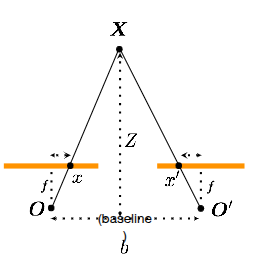

Image processing:
- Blurring: removing high frequencies
- Sharpening: boosting high frequencies
- Low spatial frequency: smooth regions/overall shapes
- High spatial frequency: edges/details/noise

### Noise Removal Filters

1. Gaussian Noise
  - Box filter
  - Gaussian filter
2. Salt & Pepper Noise
  - Median filter
3. Shot Noise

### 3.2 2D Continuous Fourier Transform

$$F(u,v) = \iint_{-\infty}^{\infty} f(x,y)\, e^{-j 2\pi (ux + vy)}\, dx\, dy.$$

### 3.3 2D Discrete Fourier Transform

An image $f(x, y)$ of size $M \times N$ is transformed via

$$F(u,v) = \sum_{x=0}^{M-1}\sum_{y=0}^{N-1} f(x,y)\, e^{-j 2\pi \left(\tfrac{u x}{M} + \tfrac{v y}{N}\right)},$$

and inverted via

$$f(x,y) = \frac{1}{MN}\sum_{u=0}^{M-1}\sum_{v=0}^{N-1} F(u,v)\, e^{\,j 2\pi \left(\tfrac{u x}{M} + \tfrac{v y}{N}\right)}.$$

Why use frequency domain?
-  Anti-aliasing: remove high frequencies before downsampling to prevent moire patterns
- JPEG compression discards high frequencies
- Efficiency in convolution as it becomes pointwise multiplication in frequency domain
- Denoising

### Properties of 2D DFT:
- Linearity: $F\{af_1 + bf_2\} = aF\{f_1\} + bF\{f_2\}$
- Shift theorem: $F\{f(x-x_0, y-y_0)\} = F(u,v)e^{-j2\pi(ux_0/M + vy_0/N)}$
- Separability: 2D DFT can be computed as two 1D DFTs
- Shift: $F\{f(x-x_0, y-y_0)\} = F(u,v)e^{-j2\pi(ux_0/M + vy_0/N)}$
- Conjugate symmetry: half of the spectrum is redundant
- Rotation: rotation in spatial domain rotates spectrum by same angle
- Convolution theorem: $F\{f * g\} = F\{f\} \cdot F\{g\}$
- Differentiation: differentiation in spatial domain corresponds to multiplication by frequency - higher frequencies are amplified - high pass operation. $\frac{\partial f(x,y)}{\partial x} = j2\pi u \cdot F(u,v)$
- Periodicity: infinitely periodic spectrum in frequency domain.

Spectral Cross & Windowing fix.

### 7.1 Why the Naive DFT Is Expensive

For an $N \times N$ image, the brute-force DFT computes $N^2$ frequency points, each requiring a sum over all $N^2$ pixels:

$$\underbrace{N^2}_{\text{points}} \times \underbrace{N^2}_{\text{summations per point}} = O(N^4).$$

### 7.3 Total 2D FFT Cost

$$\underbrace{2N}_{\text{row + column passes}} \times \underbrace{O(N \log N)}_{\text{per 1D FFT}} = O(N^2 \log N).$$

For a $1024 \times 1024$ image, this is a dramatic improvement: $O(N^4) \approx 10^{12}$ operations versus $O(N^2 \log N) \approx 10^7$ operations.

### 8.3 What the Spectrum Tells You at a Glance

| Feature in spectrum         | Meaning in image                    |
| -----------------------------| -------------------------------------|
| Bright centre (DC)          | Bright image, mostly smooth.        |
| Diffuse cloud near centre   | Natural image with coarse features. |
| Streaks at angle $\theta$   | Edges oriented at angle $\theta$.   |
| Bright outer regions        | Fine detail/Edges or noise.         |
| Nearly uniform spectrum     | Image dominated by noise.           |
| Two dots on horizontal axis | Vertical stripes.                   |
| Two dots on vertical axis   | Horizontal stripes.                 |


### Low pass vs High pass filters in frequency domain

- **Gaussian blur (low-pass).** Its spectrum is a smooth blob centred at DC — it passes low frequencies (smooth regions) and attenuates high ones (fine details/edges), which is why it blurs edges and removes noise.
- **Edge detection (high-pass).** Its spectrum is zero at DC and grows outward — it suppresses smooth regions and amplifies abrupt changes (edges, texture).

### 3.1 Three Equivalent Definitions of an Edge (1D view)

For a scanline intensity profile $f(x)$, an edge is a location:

1. where $f(x)$ changes most rapidly,
2. where $|f'(x)|$ is a **local maximum**, or
3. where $f''(x) = 0$ — a **zero-crossing** of the second derivative.

These give two algorithmic families:

| Family | Principle | Detectors |
|---|---|---|
| **Gradient-based** | Find peaks in $\lvert \nabla I \rvert$ | Sobel, Canny |
| **Laplacian-based** | Find zero-crossings of $\nabla^2 I$ | LoG (Marr–Hildreth) |

### 4.2 First Derivative — Central Difference

Use both expansions simultaneously:

$$f(x+h) = f(x) + h f'(x) + \frac{h^2}{2} f''(x) + \frac{h^3}{6} f'''(x) + \cdots \tag{1}$$

$$f(x-h) = f(x) - h f'(x) + \frac{h^2}{2} f''(x) - \frac{h^3}{6} f'''(x) + \cdots \tag{2}$$

Subtract (2) from (1) — all **even-order terms cancel**:

$$f(x+h) - f(x-h) = 2 h f'(x) + \frac{2 h^3}{6} f'''(x) + \cdots$$

Set $h = 1$ and drop the $O(h^2)$ error:

$$\boxed{f'(x) \approx \frac{f(x+1) - f(x-1)}{2}, \qquad \text{mask: } [-1 \quad 0 \quad 1]}$$

### 4.3 Second Derivative — Central (Symmetric) Form

**Add** expansions (1) and (2) instead — odd-order terms cancel:

$$f(x+h) + f(x-h) = 2 f(x) + h^2 f''(x) + \frac{h^4}{12} f^{(4)}(x) + \cdots$$

Rearrange, set $h = 1$, drop the $O(h^2)$ error:

$$\boxed{f''(x) \approx f(x+1) - 2 f(x) + f(x-1), \qquad \text{mask: } [1 \quad -2 \quad 1]}$$

### 5.1 Why Derivatives Amplify Noise

Noise model:

$$I(x) = \hat{I}(x) + N(x), \qquad N(x) \sim \mathcal{N}(0, \sigma^2) \;\text{ i.i.d.}$$

Central difference applied:

$$I(x+1) - I(x-1) = \bigl[\hat{I}(x+1) - \hat{I}(x-1)\bigr] + \bigl[N(x+1) - N(x-1)\bigr].$$

Operator-induced noise:

$$N_d(x) \triangleq N(x+1) - N(x-1).$$

$$E[N_d] = 0, \qquad \mathrm{Var}(N_d) = (1)^2\sigma^2 + (-1)^2\sigma^2 = 2\sigma^2.$$

General rule (linear filter $\{h_k\}$ on i.i.d. noise):

$$\mathrm{Var}(N_{\text{output}}) = \sigma^2 \sum_k h_k^2.$$

| Operator | Mask | $\sum_k h_k^2$ | Var |
|---|---|---|---|
| Image | — | 1 | $\sigma^2$ |
| 1st deriv | $[-1, 0, 1]$ | 2 | $2\sigma^2$ |
| 2nd deriv (1D) | $[1, -2, 1]$ | 6 | $6\sigma^2$ |
| 2D Laplacian | $\bigl[\begin{smallmatrix}0&1&0\\1&-4&1\\0&1&0\end{smallmatrix}\bigr]$ | 20 | $20\sigma^2$ |

**2D Laplacian.**

$$I(x, y) = \hat{I}(x, y) + N(x, y), \qquad N(x, y) \sim \mathcal{N}(0, \sigma^2) \;\text{ i.i.d.}$$

$$\nabla^2 I(x, y) \approx I(x+1, y) + I(x-1, y) + I(x, y+1) + I(x, y-1) - 4\, I(x, y).$$

$$\nabla^2 I = \nabla^2 \hat{I} + N_L, \qquad N_L \triangleq N(x+1, y) + N(x-1, y) + N(x, y+1) + N(x, y-1) - 4\, N(x, y).$$

$$E[N_L] = 0, \qquad \mathrm{Var}(N_L) = (1 + 1 + 1 + 1 + 16)\sigma^2 = 20\sigma^2.$$

### 5.2 Smoothing Reduces Noise

Kernel from $e^{-x^2/2}$ at $x \in \{-1, 0, +1\}$:

$$[e^{-1/2},\, 1,\, e^{-1/2}] \approx [0.607,\, 1.0,\, 0.607] \approx [1, 2, 1] \;\Longrightarrow\; h = \tfrac{1}{4}[1, 2, 1].$$

Apply to $I(x) = \hat{I}(x) + N(x)$:

$$(h * I)(x) = \tfrac{1}{4}\bigl[\hat{I}(x-1) + 2\hat{I}(x) + \hat{I}(x+1)\bigr] + \underbrace{\tfrac{1}{4}\bigl[N(x-1) + 2 N(x) + N(x+1)\bigr]}_{N_s(x)}.$$

$$E[N_s] = 0, \qquad \mathrm{Var}(N_s) = \tfrac{1}{16}(1 + 4 + 1)\,\sigma^2 = \tfrac{3}{8}\,\sigma^2.$$

Reduction: $\sigma^2 \to \tfrac{3}{8}\sigma^2$ ($\approx 2.67\times$ in variance, $1.63\times$ in std dev).

### 5.3 Scale–Noise Trade-off

Small $\sigma$ keeps edges sharp and detects fine details but suppresses noise weakly; large $\sigma$ strongly suppresses noise but blurs edges and only resolves coarse structure — no universally optimal $\sigma$, the choice is application-dependent.

### 6. Derivative Theorem of Convolution

$$\frac{d}{dx}(f * G) = f * \frac{dG}{dx}, \qquad \nabla^2(f * G) = f * \nabla^2 G.$$

> **Observation.** Without the identity, edge detection takes two convolutions at runtime (smooth, then differentiate). With it, precompute the Derivative-of-Gaussian kernel once offline and apply as a **single convolution** — cheaper and cleaner.

### 7. Criteria for an Optimal Edge Detector

- **Good detection** — minimize false positives (noise edges) and false negatives (missed edges).
- **Good localization** — detected edge close to the true edge location.
- **Single response** — one output pixel per true edge.

### 8. Sobel

Kernels:

$$G_x = \begin{bmatrix}+1 & 0 & -1 \\ +2 & 0 & -2 \\ +1 & 0 & -1\end{bmatrix}, \qquad G_y = \begin{bmatrix}+1 & +2 & +1 \\ 0 & 0 & 0 \\ -1 & -2 & -1\end{bmatrix}.$$

Separable: $G_x = [1, 2, 1]^T \cdot [+1, 0, -1]$ — smooth $\perp$ derivative + central difference in one pass.

Output:

$$G = \sqrt{G_x^2 + G_y^2}, \qquad \Theta = \mathrm{atan2}(G_y, G_x), \qquad \text{edge if } G > \tau.$$

**Limitations.**

- Only mild noise suppression from $[1, 2, 1]$ — not a true Gaussian.
- Thick edges — no thinning, gradient ridge spans multiple pixels.
- Single $\tau$ is brittle — fragments contours at weak points or admits noise.
- No connectivity — pixels thresholded independently, output is points not curves.
- Directional bias — diagonals get weaker response, gradient direction biased toward axes.

### 9. Canny

1. **DoG.** $I_x = I * \partial_x G_\sigma$, $I_y = I * \partial_y G_\sigma$. Single convolution, noise variance $2\sigma^2$.
2. **Magnitude/direction.** $\|\nabla I\| = \sqrt{I_x^2 + I_y^2}$, $\theta = \mathrm{atan2}(I_y, I_x)$. Ridges still thick.
3. **Non-Maximum Suppression.** Keep $q$ iff $\|\nabla I(q)\|$ is strictly greater than both neighbours along $\theta$ (quantized to $0°, 45°, 90°, 135°$). Thins ridges to one pixel.
4. **Hysteresis.** $\|\nabla I\| \geq T_{\text{hi}}$ → strong (kept); $T_{\text{lo}} \leq \|\nabla I\| < T_{\text{hi}}$ → weak (kept iff connected to a strong); $< T_{\text{lo}}$ → discard. Traces contours through dips.

### 10. 2D Laplacian Mask

Definition — divergence of gradient:

$$\nabla^2 = \nabla \cdot \nabla = \begin{bmatrix}\partial/\partial x\\ \partial/\partial y\end{bmatrix} \cdot \begin{bmatrix}\partial/\partial x\\ \partial/\partial y\end{bmatrix} = \frac{\partial^2}{\partial x^2} + \frac{\partial^2}{\partial y^2}.$$

Discrete (central second differences):

$$\frac{\partial^2 I}{\partial x^2} \approx I(i, j+1) - 2 I(i, j) + I(i, j-1), \qquad \frac{\partial^2 I}{\partial y^2} \approx I(i+1, j) - 2 I(i, j) + I(i-1, j),$$

$$\nabla^2 I(i, j) \approx I(i, j+1) + I(i, j-1) + I(i+1, j) + I(i-1, j) - 4\, I(i, j).$$

Mask = sum of two 1D second-derivative masks:

$$\underbrace{\begin{bmatrix}0&0&0\\1&-2&1\\0&0&0\end{bmatrix}}_{\partial^2/\partial x^2} + \underbrace{\begin{bmatrix}0&1&0\\0&-2&0\\0&1&0\end{bmatrix}}_{\partial^2/\partial y^2} = \underbrace{\begin{bmatrix}0&1&0\\1&-4&1\\0&1&0\end{bmatrix}}_{\nabla^2}.$$

**Properties.**

- **Isotropic** — equal weights on all four neighbours.
- **Single mask, cheaper than gradient** — one convolution vs two ($I_x$, $I_y$) plus magnitude.
- **No directional info** — scalar response; orientation $\theta$ unrecoverable.
- **Very noise-sensitive** — twice differentiation ⇒ $20\sigma^2$ amplification (2D); unusable on raw images.

**Two issues with bare Laplacian (and their fixes).**

1. **Sensitive to fine detail/noise** ⇒ smooth first ⇒ **LoG** (§11).
2. **Responds equally to strong and weak edges** (any sign change is a zero-crossing) ⇒ **gate by $|\nabla I| > \tau$** (§13).

### 11. LoG (Marr–Hildreth)

$$\mathrm{LoG}(x, y) = \frac{-1}{\pi \sigma^4}\left(1 - \frac{x^2 + y^2}{2\sigma^2}\right) e^{-(x^2 + y^2)/2\sigma^2}.$$

Mexican hat / sombrero shape:

- Negative at the centre where $r < \sigma\sqrt{2}$.
- **Zero at $r = \sigma\sqrt{2}$ — the edge location.**
- Positive in the surrounding ring where $r > \sigma\sqrt{2}$.

### 13. LoG Thresholding

Don't threshold $|R| > \tau$ directly — picks up both sides of the edge as two parallel lines.

Two stages on $R = f * \nabla^2 G_\sigma$:

1. **Zero-crossings.** Pixel $(i, j)$ is a candidate if $R(i, j)$ and an adjacent $R$ have opposite signs. Strength $= |R(p) - R(q)|$ across the crossing.
2. **Gradient gating.** Keep crossing iff $|\nabla I|(x, y) > \tau$ — a real edge has both a zero-crossing in $\nabla^2 I$ and a large $|\nabla I|$; noise has only the crossing.

### 14. Difference of Gaussians (DoG)

$$\mathrm{DoG} = G_{\sigma_1} - G_{\sigma_2}, \qquad \sigma_1 < \sigma_2.$$

Approximates LoG via $\dfrac{\partial G_\sigma}{\partial \sigma} = \sigma\, \nabla^2 G_\sigma$.

**Derivation.** Let $r^2 = x^2 + y^2$, $G_\sigma = \dfrac{1}{2\pi\sigma^2} e^{-r^2/2\sigma^2}$.

$\sigma$-derivative (product rule on prefactor + exponent):

$$\frac{\partial G_\sigma}{\partial \sigma} = -\frac{1}{\pi\sigma^3}e^{-r^2/2\sigma^2} + \frac{r^2}{2\pi\sigma^5}e^{-r^2/2\sigma^2} = \frac{1}{\pi\sigma^3}\left(\frac{r^2}{2\sigma^2} - 1\right) e^{-r^2/2\sigma^2}.$$

Laplacian. First differentiate $G_\sigma$ in $x$:

$$\frac{\partial G_\sigma}{\partial x} = -\frac{x}{\sigma^2}\, G_\sigma.$$

Differentiate again (product rule):

$$\frac{\partial^2 G_\sigma}{\partial x^2} = \left(\frac{x^2}{\sigma^4} - \frac{1}{\sigma^2}\right) G_\sigma, \qquad \frac{\partial^2 G_\sigma}{\partial y^2} = \left(\frac{y^2}{\sigma^4} - \frac{1}{\sigma^2}\right) G_\sigma \quad \text{(by symmetry).}$$

Sum:

$$\nabla^2 G_\sigma = \left(\frac{r^2}{\sigma^4} - \frac{2}{\sigma^2}\right) G_\sigma = \frac{1}{\pi\sigma^4}\left(\frac{r^2}{2\sigma^2} - 1\right) e^{-r^2/2\sigma^2}.$$

Ratio of prefactors $\sigma^{-3} / \sigma^{-4} = \sigma$, so $\dfrac{\partial G_\sigma}{\partial \sigma} = \sigma\, \nabla^2 G_\sigma$. $\square$

Finite-difference Taylor expansion:

$$G_{\sigma + \Delta\sigma} - G_\sigma \approx \Delta\sigma \cdot \frac{\partial G_\sigma}{\partial \sigma} = (\sigma\, \Delta\sigma)\, \nabla^2 G_\sigma.$$

Cheaper than LoG (two blurs, no explicit second derivative); basis of SIFT for multi-scale keypoint detection.

### 15. Detector Comparison

| Property | Sobel | Canny | LoG |
|---|---|---|---|
| **Derivative order** | 1st | 1st | 2nd |
| **Noise handling** | Mild $[1, 2, 1]$ | Explicit $G_\sigma$ | $G_\sigma$ embedded |
| **Noise amplification** | $2\sigma^2$ | $2\sigma^2$ | $6\sigma^2$ (1D), $20\sigma^2$ (2D) |
| **Edge thickness** | Thick | 1-pixel (NMS) | 1-pixel (zero-crossing) |
| **Thresholding** | Single $\tau$ on $G$ | Dual hysteresis | Zero-crossing + $\lvert\nabla I\rvert > \tau$ |
| **Edge connectivity** | None | Yes | Moderate |
| **Directional info** | Yes ($\theta$) | Yes ($\theta$) | No |
| **Best for** | Fast, clean images | General purpose | Non-sharp edges, SIFT |

**Gradient vs LoG.**

- **Gradient detectors** work best on images with sharp intensity transitions and low noise, where magnitude peaks are tall, narrow, and easy to threshold.
- **LoG zero-crossings** localise edges more accurately when transitions are gradual or diffuse: a zero-crossing sits at a fixed position regardless of slope, whereas the location of a gradient peak on a wide ramp drifts with the threshold $\tau$.

---

## Blob Detection

### 16. Properties of a Good Keypoint

- **Repeatability** — detected consistently across viewpoint, scale, and lighting changes.
- **Saliency** — descriptor is locally unique and distinctive.
- **Compactness** — far fewer features than pixels.
- **Locality** — small spatial extent; robust to occlusion and clutter.

### 16.1 Basic Idea

Convolve image with a blob filter at multiple scales; find **extrema** (max *and* min) in scale-space $(x, y, \sigma)$. Two simultaneous selections:

- **Spatial selection** — *where* in the image the response peaks (blob centre).
- **Scale selection** — *at which $\sigma$* the response peaks (characteristic size).

### 16.2 Edges to Blobs — Spatial Selection

- 1D Laplacian zero-crossing = edge ⇒ single *ripple*.
- Blob ≈ superposition of two back-to-back edges ⇒ *pair of ripples* reinforcing at the centre.
- Magnitude peaks at blob centre **iff $\sigma$ matches the blob's scale**; mismatch shifts the ripples and the centre reinforcement collapses.

### 17. Why the Raw Response Decays with $\sigma$

**Scale-selection problem.** Naive $\arg\max_\sigma |L_\sigma * I|$ fails because raw Laplacian response decays monotonically with $\sigma$ ⇒ argmax biased to smallest scale.

**1D Gaussian and derivatives** (reference):

$$g(x, \sigma) = \frac{1}{\sigma\sqrt{2\pi}} e^{-x^2/2\sigma^2}, \quad \frac{\partial g}{\partial x} = -\frac{x}{\sigma^3\sqrt{2\pi}} e^{-x^2/2\sigma^2}, \quad \frac{\partial^2 g}{\partial x^2} = -\frac{\sigma^2 - x^2}{\sigma^5\sqrt{2\pi}} e^{-x^2/2\sigma^2}.$$

Take a step $f(x) = \mathbb{1}[x \geq 0]$ and apply the $k$-th-derivative-of-Gaussian filter $G_\sigma^{(k)}$. Derivative theorem lets us move derivatives between signal and kernel:

$$R_k(x, \sigma) \;\triangleq\; f * G_\sigma^{(k)} \;=\; f^{(k)} * G_\sigma \;=\; f' * G_\sigma^{(k-1)}.$$

Since $f' = \delta$, the response collapses to a $(k-1)$-th derivative of a Gaussian:

$$R_k(x, \sigma) \;=\; \delta * G_\sigma^{(k-1)} \;=\; G_\sigma^{(k-1)}(x).$$

**$k = 1$ (gradient).** $R_1 = G_\sigma$, peak at $x = 0$:

$$R_1(0, \sigma) = \frac{1}{\sigma\sqrt{2\pi}} \;\propto\; \frac{1}{\sigma}.$$

**$k = 2$ (Laplacian).** $R_2 = G_\sigma'$:

$$R_2(x, \sigma) = -\frac{x}{\sigma^3\sqrt{2\pi}}\, e^{-x^2/2\sigma^2}, \qquad \text{extrema at } x = \pm\sigma.$$

$$\lvert R_2(\pm\sigma, \sigma) \rvert = \frac{1}{\sigma^2\sqrt{2\pi}}\, e^{-1/2} \;\propto\; \frac{1}{\sigma^2}.$$

**General.** The $m$-th derivative $G_\sigma^{(m)}$ scales as $\sigma^{-(m+1)}$ at its extrema. Setting $m = k - 1$, the step response of the $k$-th-derivative filter decays as

$$\lvert R_k \rvert_{\max} \;\propto\; \sigma^{-k}.$$

**Scale-normalisation** (Lindeberg $\gamma$-normalisation): multiply $k$-th derivative by $\sigma^{k}$.

| Filter | Factor |
|---|---|
| Gradient | $\times \sigma$ |
| Laplacian | $\times \sigma^2$ |

$$\nabla^2_{\mathrm{norm}} g = \sigma^2\left(\frac{\partial^2 g}{\partial x^2} + \frac{\partial^2 g}{\partial y^2}\right).$$

Caveat: factors are derived rigorously for Gaussian-matched blobs; the step-edge analysis is heuristic motivation.

### 18. Optimal Scale for a Circular Blob

LoG zero-crossing at $\rho = \sigma\sqrt{2}$. Response maximised when zero-crossing aligns with disc boundary of radius $r$:

$$\sigma\sqrt{2} = r \;\Longrightarrow\; \sigma^{*} = \frac{r}{\sqrt{2}}, \qquad r = \sigma^{*}\sqrt{2}.$$

Detected blobs visualised as circles of radius $\sigma^{*}\sqrt{2}$.

### 19. Scale-Space Blob Detection Pipeline

1. **Build scale-space** — compute scale-normalised LoG at $\sigma_1 < \sigma_2 < \cdots < \sigma_n$; stack into 3D volume $(x, y, \sigma)$.
2. **3D extrema detection** — local max/min of squared LoG against **26 neighbours** (8 same scale + 9 above + 9 below). Output: keypoint $(x, y, \sigma^{*})$.

**Efficient implementation — DoG.** From $\partial G_\sigma/\partial\sigma = \sigma\,\nabla^2 G_\sigma$:

$$\mathrm{DoG}(x, y, \sigma) = G(x, y, k\sigma) - G(x, y, \sigma) \approx (k-1)\,\sigma^2\,\nabla^2 g_\sigma.$$

DoG $\approx$ scale-normalised LoG up to constant $(k-1)$. A DoG extremum between $\sigma$ and $k\sigma$ is assigned to the **smaller** scale $\sigma$ ⇒ radius $r = \sigma\sqrt{2}$.

**DoG pyramid (Lowe 2004):**

1. Gaussian pyramid — within each octave, blur at $\sigma, k\sigma, k^2\sigma, \ldots$
2. Subtract adjacent layers → DoG stack.
3. 26-neighbour 3D extrema search.
4. Next octave: downsample by 2.

$$\sigma_{\mathrm{absolute}} = \sigma_0 \cdot k^{i} \cdot 2^{o}, \qquad k = 2^{1/s}.$$

**SIFT descriptor:** $16 \times 16$ patch → $4 \times 4$ cell grid → 8-bin gradient histogram per cell → concatenate to $4 \times 4 \times 8 = 128$-dim vector.

### 20. SIFT Invariance

- **Rotation invariance** — estimate dominant gradient orientation at the keypoint; rotate the patch to align with it before computing the descriptor.
- **Illumination invariance** — $L_2$-normalise the 128-dim vector (cancels multiplicative brightness); additive offsets already cancel since gradients depend on intensity *differences*.

---

## Harris Corner Detector

### 21. Local Region Types

| Region | Window Response | Gradient Scatter |
|---|---|---|
| **Flat** | No change in any direction | Tight dot at origin |
| **Edge** | Change only $\perp$ to edge | Elongated ellipse along one axis |
| **Corner** | Large change in **all** directions | Broad, near-isotropic blob |

### 22. SSD Error

$$E(u, v) = \sum_{x, y} w(x, y)\,\bigl[\,I(x+u,\, y+v) - I(x, y)\,\bigr]^2.$$

Window $w(x, y)$: **rectangular box** ($w = 1$ inside, $0$ outside) or **Gaussian** $G_\sigma$.

Regimes:

- **Flat** ⇒ $E \approx 0$ for all shifts.
- **Edge** ⇒ $E \approx 0$ along the edge direction, large across it.
- **Corner** ⇒ $E$ large in *every* shift direction.

### 23. Quadratic Form & Structure Tensor

**Taylor (small motion):** $I(x+u, y+v) \approx I + u I_x + v I_y$ ⇒

$$E(u, v) \approx \sum_{x, y} w(x, y)\,(u I_x + v I_y)^2 = \begin{bmatrix} u & v \end{bmatrix} M \begin{bmatrix} u \\ v \end{bmatrix},$$

$$\boxed{\; M = \sum_{x, y} w(x, y) \begin{bmatrix} I_x^2 & I_x I_y \\ I_x I_y & I_y^2 \end{bmatrix} = \begin{bmatrix} S_{x^2} & S_{xy} \\ S_{xy} & S_{y^2} \end{bmatrix}. \;}$$

Entries are **products of gradient components** ($\neq$ second derivatives). With $w = G_{\sigma_I}$:

$$I_x = \partial_x G_{\sigma_D} \ast I, \qquad I_y = \partial_y G_{\sigma_D} \ast I,$$

$$S_{x^2} = G_{\sigma_I} \ast (I_x \circ I_x), \quad S_{y^2} = G_{\sigma_I} \ast (I_y \circ I_y), \quad S_{xy} = G_{\sigma_I} \ast (I_x \circ I_y).$$

### 24. Eigenvalues & Corner Response $R$

$\lambda_1, \lambda_2$ of $M$ = squared semi-axes of the gradient scatter ellipse (radii $\sqrt{\lambda_1}, \sqrt{\lambda_2}$).

$$\boxed{\; R = \det(M) - k\,(\mathrm{tr}\, M)^2 = \lambda_1 \lambda_2 - k\,(\lambda_1 + \lambda_2)^2, \qquad k \in [0.04,\, 0.06]. \;}$$

- **Flat** ($\lambda_1, \lambda_2 \approx 0$): $R \approx 0$.
- **Edge** ($\lambda_1 \gg 0,\ \lambda_2 \approx 0$): $R \approx -k\,\lambda_1^2 \ll 0$.
- **Corner** ($\lambda_1 \approx \lambda_2 = \lambda$ large): $R \approx (1 - 4k)\,\lambda^2 \gg 0$.

### 25. Pipeline

1. **Differentiate** — by the derivative theorem of convolution, applying $\partial_x G_{\sigma_D}$ once is the same as smooth-then-differentiate:

$$I_x \;=\; (\partial_x G_{\sigma_D}) \ast I \;=\; \partial_x (G_{\sigma_D} \ast I), \qquad \text{similarly } I_y.$$

2. **Sobel** — in practice the analytical kernel $\partial_x G_{\sigma_D}$ is replaced by the discrete $K_x$ (separable: smooth $\otimes$ differentiate), so $K_x \approx \partial_x G_{\sigma_D \approx 1}$ and the chain becomes

$$I \;\xrightarrow{\;K_x\,\ast\;}\; I_x \;\;\Longleftrightarrow\;\; I \;\xrightarrow{\;\partial_x G_{\sigma_D}\,\ast\;}\; I_x.$$

$$K_x = \begin{bmatrix} 1 \\ 2 \\ 1 \end{bmatrix} \otimes \begin{bmatrix} -1 & 0 & +1 \end{bmatrix} = \begin{bmatrix} -1 & 0 & 1 \\ -2 & 0 & 2 \\ -1 & 0 & 1 \end{bmatrix}, \quad K_y = \begin{bmatrix} -1 \\ 0 \\ +1 \end{bmatrix} \otimes \begin{bmatrix} 1 & 2 & 1 \end{bmatrix}.$$

3. **Hadamard products:** $I_{x^2} = I_x \circ I_x,\ I_{y^2} = I_y \circ I_y,\ I_{xy} = I_x \circ I_y$.

4. **Integration smoothing:** $S_{x^2} = G_{\sigma_I} \ast I_{x^2},\ S_{y^2} = G_{\sigma_I} \ast I_{y^2},\ S_{xy} = G_{\sigma_I} \ast I_{xy}$.

5. **Build** $M = \begin{bmatrix} S_{x^2} & S_{xy} \\ S_{xy} & S_{y^2} \end{bmatrix}$.

6. **Response + NMS:** $R = \det(M) - k\,(\mathrm{tr}\, M)^2$, threshold, then non-maximum suppression.

### 26. Two Smoothing Scales

- **$\sigma_D$** — *differentiation* scale (≈0.5–1.0); pre-smooth before derivative.
- **$\sigma_I$** — *integration* scale (≈1.5–2.0); width of the Gaussian window $w = G_{\sigma_I}$ that pools gradient products into $M$ over a local neighbourhood, allowing it to average many independent gradient samples.
- Relation: $\sigma_I = \gamma\, \sigma_D$, $\gamma \approx 1.5\text{–}2$ — keeps the integration window comfortably larger than the differentiation kernel.

### 27. Invariance of the Corner Response $R$ (and Detected Locations)

**Invariant:**

- **Translation** — only local gradient products enter $M$.
- **Rotation** — $M \to R\, M\, R^{\!\top}$ preserves the spectrum, and $R$ depends only on $\lambda_1, \lambda_2$.
- **Additive intensity** $I \to I + b$ — derivatives kill the constant.

**Partial:**

- **Multiplicative intensity** $I \to a I \Rightarrow R \to a^2 R$ — corner *locations* unchanged; threshold must be rescaled.

**Not invariant:**

- **Scale (zoom).** Window has *fixed pixel size*: as the image is zoomed in, the same physical corner spans more pixels and the window only covers an arc segment of one contour, so $\lambda_1 \gg \lambda_2 \approx 0$ and $R$ flips from large positive (corner) to large negative (edge).
- **Affine.** Since affine ⊃ scaling, Harris is also **not affine-invariant**.

---

## SIFT Detector — Full Pipeline (Lowe 2004)

### 28. Scale Space

$$L(x, y, \sigma) = G(x, y, \sigma) \ast I(x, y).$$

- **Effect of $\sigma$:** small $\sigma$ ⇒ fine details (edges, textures); large $\sigma$ ⇒ coarse details (blobs, shapes).
- **Naive cost:** kernel size $\approx 6\sigma \times 6\sigma$ ⇒ convolution at scale $\sigma$ costs $O(\sigma^2 W H)$.
- **Pyramid trick:** blur at $\sigma$ on full-resolution image $\equiv$ blur at $\sigma / 2$ on 2× downsampled image — small kernels on small images replace large kernels on the original.

### 29. Octaves & Scales

Within each octave, $s + 3$ blurred images at

$$\sigma_i = \sigma_0\, k^i, \qquad k = 2^{1/s}, \qquad \sigma_0 = 1.6,\ s = 3.$$

- $s + 3$ blurs ⇒ $s + 2$ DoGs ⇒ search middle $s$ for extrema.
- $\#\text{octaves} = \log_2(\min(W, H)) - C,\ C \approx 3$ (e.g. $512^2 \Rightarrow 6$ octaves).
- **Downsample = blur first** (level $s$ has $\sigma = 2\sigma_0$, kills frequencies above the new Nyquist) **then keep every 2nd pixel**.
- **Local vs. absolute $\sigma$:** every octave runs the same $\sigma_0 \to 2\sigma_0$ sweep; absolute scale $\sigma_{\text{abs}}(o, i) = 2^o \sigma_0 k^i$.

### 30. DoG ≈ Scale-Normalised LoG

From $\partial G_\sigma / \partial \sigma = \sigma\, \nabla^2 G_\sigma$:

$$D_i = L(k\sigma_i) - L(\sigma_i) \approx (k - 1)\, \underbrace{\sigma_i^2\, \nabla^2 G_{\sigma_i} \ast I}_{\text{scale-normalised LoG at }\sigma_i}.$$

DoG between $\sigma_i$ and $k\sigma_i$ approximates the scale-normalised LoG at the *smaller* scale $\sigma_i$.

### 31. Extrema Detection (26-Neighbour Test)

For each interior DoG layer $i$, test $(x, y, i)$ against $8$ (same layer) $+\ 9$ (above) $+\ 9$ (below) $= 26$ neighbours; keep if strict local max or min. Captures *spatially distinctive + scale-matched* points.

### 32. Sub-Pixel Localisation (3D Taylor)

Expand $D(x, y, \sigma)$ around discrete extremum, $\Delta = (x - x_i,\ y - y_i,\ \sigma - \sigma_i)^\top$:

$$D(\Delta) = D_0 + \nabla D^\top \Delta + \tfrac{1}{2}\Delta^\top H \Delta.$$

$$\nabla D = (D_x, D_y, D_\sigma)^\top, \qquad H = \begin{pmatrix} D_{xx} & D_{xy} & D_{x\sigma} \\ D_{yx} & D_{yy} & D_{y\sigma} \\ D_{\sigma x} & D_{\sigma y} & D_{\sigma\sigma} \end{pmatrix}.$$

$$\partial D / \partial \Delta = 0 \;\Rightarrow\; \boxed{\; \hat\Delta = -H^{-1} \nabla D \;}, \qquad D(\hat\Delta) = D_0 + \tfrac{1}{2} \nabla D^\top \hat\Delta.$$

If $|\hat\Delta_j| > 0.5$ in any dimension ⇒ step to neighbour and repeat.

### 33. Rejection Tests

**Low contrast:**

$$|D(\hat\Delta)| < 0.03 \;\Rightarrow\; \textbf{reject}.$$

**Edge response.** Spatial $2 \times 2$ Hessian; $\lambda_1, \lambda_2$ = principal curvatures of $D(x, y)$:

$$H = \begin{pmatrix} D_{xx} & D_{xy} \\ D_{yx} & D_{yy} \end{pmatrix}, \qquad \frac{(\mathrm{tr}\, H)^2}{\det H} < \frac{(r+1)^2}{r} \;\Rightarrow\; \textbf{keep}, \quad r = 10.$$

Equivalent to $\lambda_1 / \lambda_2 < r$. Edge ⇒ $\lambda_1 \gg \lambda_2$ ⇒ reject.

### 34. Orientation Assignment

Gradient computed on $L(x, y, \sigma_{\text{kp}})$ — the blurred image at the keypoint's own scale:

$$m(x, y) = \sqrt{\bigl(L(x+1, y) - L(x-1, y)\bigr)^2 + \bigl(L(x, y+1) - L(x, y-1)\bigr)^2},$$

$$\theta(x, y) = \tan^{-1}\!\left(\frac{L(x, y+1) - L(x, y-1)}{L(x+1, y) - L(x-1, y)}\right).$$

- Circular window of radius $\approx 1.5\sigma$ around the keypoint, weight $w = G_{1.5\sigma}$.
- **36-bin histogram** ($10°$ each); vote $w \cdot m$ into bin of $\theta$.
- $\theta^*$ = bin of the **global maximum** of the histogram — the dominant orientation.
- **Multiple orientations:** for any *other local peak* (a local maximum that is not the global one) whose height $\geq 0.8 \times$ global max, **duplicate the keypoint** with that peak's bin as its own $\theta^*$. ("Peak" $\neq$ "max": peaks are *all* local maxima of the histogram; max is the *single highest* peak.)

### 35. Descriptor (128-D)

- $16 \times 16$ window centred on keypoint, **physically rotated by $-\theta^*$** (rotation invariance).
- Split into $4 \times 4$ grid of cells ($4 \times 4$ pixels each).
- Per pixel compute the **gradient magnitude** $m(x, y)$ and the rotation-aligned orientation $\theta_{\text{rel}}(x, y) = \theta(x, y) - \theta^*$ (same $m, \theta$ formulas as in §34), plus a Gaussian spatial weight centred on the keypoint $(x_k, y_k)$:

$$w(x, y) = \exp\!\left(-\frac{(x - x_k)^2 + (y - y_k)^2}{2(1.5\sigma)^2}\right).$$

- Vote $w(x, y) \cdot m(x, y)$ into the **8-bin** ($45°$ each) histogram of $\theta_{\text{rel}}$ of the cell that contains the pixel.
- Concatenate: $16 \text{ cells} \times 8 \text{ bins} = 128\text{-D}$. (General rule: $p \cdot n^2$.)
- **$L_2$-normalise:** $\hat{\mathbf{d}} = \mathbf{d} / \|\mathbf{d}\|$. Illumination behaviour:
  - **Multiplicative ($I \to a I$) — invariant.** All $m$ scale by $a$, so $\mathbf{d} \to a\mathbf{d}$; division by norm cancels $a$.
  - **Additive ($I \to I + b$) — invariant for free.** Gradients kill the constant before the histogram is built.
  - **Non-linear illumination (gamma, saturation) — NOT invariant.** Mitigation: clip each $\hat d_i$ at $0.2$ to suppress saturated dominant gradients, then re-normalise.

### 36. Matching

- **Nearest neighbour:** $d(\mathbf{x}_i, \mathbf{y}_j) = \|\mathbf{x}_i - \mathbf{y}_j\|_2$.
- **Lowe's ratio test:** $d_1 / d_2 < 0.8 \Rightarrow$ accept; self-normalising, rejects ambiguous matches (e.g. repetitive textures).
- **RANSAC** geometric verification (homography / fundamental matrix) discards remaining outliers.

### 37. End-to-End SIFT Pipeline

```
Input image
     ↓
Build Gaussian pyramid: s+3 blurs/octave, σᵢ = σ₀·kᵢ, k = 2^(1/s)
     ↓
DoG stack: Dᵢ = L(σᵢ₊₁) − L(σᵢ)              (s+2 per octave)
     ↓
26-neighbour 3D extrema  →  candidate (x, y, σ)
     ↓
Sub-pixel refine:  Δ̂ = −H⁻¹ ∇D
     ↓
Reject:  |D(Δ̂)| < 0.03                          (low contrast)
         (Tr H)² / Det H  ≥  (r+1)²/r,  r = 10   (edge response)
     ↓
Orientation:  36-bin histogram of w·m at scale σ;  peak ≥ 0.8·max
     ↓
Descriptor:   rotate 16×16 by −θ*;  4×4 cells × 8 bins  =  128-D
     ↓
L₂-normalise  (clip at 0.2, re-normalise)
     ↓
Match:  nearest-neighbour + Lowe ratio < 0.8
     ↓
Geometric verification (RANSAC, homography / fundamental matrix)
```

Applications: panorama stitching, 3D reconstruction, object recognition, robot localisation, video tracking, medical image registration.

---

## 2D Image Transformations

### 38. Filtering vs. Warping

- **Filtering** ($G(x) = h(F(x))$) — modifies pixel **values** (range): blur, edge detection, sharpening.
- **Warping** ($G(x) = F(h(x)))$ — modifies pixel **locations** (domain): rotation, scaling, perspective warp.

### 39. 2×2 Linear Transforms

A linear transform $x' = A\, x$ preserves the origin and maps lines to lines. Tested by additivity ($F(x_1 + x_2) = F(x_1) + F(x_2)$) and homogeneity ($F(\lambda x) = \lambda F(x)$).

| Transform | Matrix |
|---|---|
| Scale | $\begin{bmatrix} s_x & 0 \\ 0 & s_y \end{bmatrix}$ |
| Rotate | $\begin{bmatrix} \cos\theta & -\sin\theta \\ \sin\theta & \cos\theta \end{bmatrix}$ |
| Shear | $\begin{bmatrix} 1 & s_x \\ s_y & 1 \end{bmatrix}$ |
| Flip across $y$ | $\begin{bmatrix} -1 & 0 \\ 0 & 1 \end{bmatrix}$ |
| Flip across $x$ | $\begin{bmatrix} 1 & 0 \\ 0 & -1 \end{bmatrix}$ |
| Flip across origin | $\begin{bmatrix} -1 & 0 \\ 0 & -1 \end{bmatrix}$ |
| Identity | $\begin{bmatrix} 1 & 0 \\ 0 & 1 \end{bmatrix}$ |


**Homogeneous embedding.** Append $1$: $(x, y) \to (x, y, 1)$; recover via $(x, y, w) \to (x/w, y/w)$. A homogeneous point is a *ray* through the origin in $\mathbb{R}^3$ — invariant under scalar multiplication: $(x, y, w) \sim (\lambda x, \lambda y, \lambda w)$.

> **Geometric insight.** 2D translation is a **3D shear along the $w$-axis**: $t_x, t_y$ shear projective $\mathbb{R}^3$ in a way that, on slicing back to the $w = 1$ plane, looks like a translation.

### 41. General Homogeneous Transform

$$\tilde{x}' = H\,\tilde{x}, \qquad H = \left[\begin{array}{c|c} A & t \\ \hline \mathbf{0}^{\!\top} & 1 \end{array}\right] = \left[\begin{array}{cc|c} a & b & t_x \\ c & d & t_y \\ \hline 0 & 0 & 1 \end{array}\right].$$

- $A_{2\times 2}$: rotation, scale, shear.
- $t_{2\times 1}$: translation.
- Bottom row: $[0\ 0\ 1]$ for affine; **free** $[g\ h\ i]$ for projective.

### 42. Composition Order

Composition is non-commutative in general — order is read **right-to-left**: $p' = M_n \cdots M_1\, p$. Standard convention is **Scale → Rotate → Translate**: $M = T \cdot R \cdot S$, giving

$$M = \begin{bmatrix} s_x \cos\theta & -s_y \sin\theta & t_x \\ s_x \sin\theta & s_y \cos\theta & t_y \\ 0 & 0 & 1 \end{bmatrix}.$$

**When does $M_1 M_2 = M_2 M_1$?** 

Let $T$ = translation, $R$ = rotation, $S$ = scaling (uniform $S_{\text{unif}} = sI$ or non-uniform $\mathrm{diag}(s_x, s_y)$), $A$ = any linear $2\times 2$ transform. Commutative cases:

- $T_1 \circ T_2$ — vector addition is abelian.
- $R_\alpha \circ R_\beta$ — common centre (origin); angles add: $R_{\alpha+\beta}$.
- $S_{\text{unif}} \circ A$ — $sI$ commutes with every matrix.
- $S_{s_1} \circ S_{s_2}$ — scalars multiply.

All other pairs (e.g. $T \circ R$, $S_{\text{non-unif}} \circ R$, $S \circ T$) are **non-commutative**.

### 43. Transformation Hierarchy

```
All 2D Transformations
│
├── Linear (2×2, origin preserved)
│   ├── Scale          [DOF 2]
│   ├── Rotation       [DOF 1]
│   ├── Shear          [DOF 2]
│   └── Flip / Reflect [DOF 0]
│
└── Affine & beyond (3×3 homogeneous)
    │
    ├── Translation    [DOF 2]    bottom row [0 0 1]
    │       ↓ + Rotation
    ├── Euclidean      [DOF 3]    preserves distances, angles
    │       ↓ + Uniform scale
    ├── Similarity     [DOF 4]    preserves angles, distance ratios
    │       ↓ + Non-uniform scale + Shear
    ├── Affine         [DOF 6]    preserves parallelism, lines
    │       ↓ + Free bottom row (perspective)
    └── Projective     [DOF 8]    preserves only lines (homography)
```

$$\text{Translation} \subset \text{Euclidean} \subset \text{Similarity} \subset \text{Affine} \subset \text{Projective}.$$


### 44. Master Table — What Each Transform Violates

| Transform | Matrix | DOF | Violates |
|---|---|---|---|
| Linear (origin-fixed) | $\begin{bmatrix} a & b & 0 \\ c & d & 0 \\ 0 & 0 & 1 \end{bmatrix}$ | 4 | distances, angles, areas, orientation (if $\det A < 0$) |
| Translation | $\begin{bmatrix} 1 & 0 & t_x \\ 0 & 1 & t_y \\ 0 & 0 & 1 \end{bmatrix}$ | 2 | absolute position only |
| Euclidean | $\begin{bmatrix} \cos\theta & -\sin\theta & t_x \\ \sin\theta & \cos\theta & t_y \\ 0 & 0 & 1 \end{bmatrix}$ | 3 | absolute position & orientation only |
| Similarity | $\begin{bmatrix} s\cos\theta & -s\sin\theta & t_x \\ s\sin\theta & s\cos\theta & t_y \\ 0 & 0 & 1 \end{bmatrix}$ | 4 | absolute distances, absolute areas |
| Affine | $\begin{bmatrix} a & b & t_x \\ c & d & t_y \\ 0 & 0 & 1 \end{bmatrix}$ | 6 | distances, angles |
| Projective | $\begin{bmatrix} a & b & c \\ d & e & f \\ g & h & i \end{bmatrix}$ | 8 | parallelism, distances, angles |

Distortions accumulate strictly down the table.

### 45. Estimating a Transform from Correspondences

```
Original image  →  Detect features {xᵢ}   [SIFT, ORB, ...]
Warped image    →  Detect features {xⱼ'}
        ↓
Match:    for each xᵢ, nearest-neighbour over {xⱼ'} by L₂ descriptor distance
          keep pair iff Lowe ratio  d₁ / d₂ < 0.8     →  correspondences (xᵢ, xᵢ')
        ↓
Solve:    p̂ = argmin_p  Σᵢ ‖ xᵢ' − f(xᵢ; p) ‖²        (closed-form / DLT + RANSAC)
        ↓
Output:   transformation matrix H (or M)
```

Minimum correspondences: **3** for affine (6 DOF), **4** for homography (8 DOF, no 3 collinear). RANSAC discards outlier matches.

### 46. Applications

- **Image stitching / panoramas** — solve homography between overlapping frames.
- **SLAM** — frame-to-frame camera-pose estimation via feature matching.
- **Document scanning** — unwarp perspective-distorted photos.
- **Face alignment** — register facial landmarks for recognition.

---

## Image Homographies

### 47. Classification — Preserves View

| Transform | Matrix | DOF | Preserves |
|---|---|---|---|
| Translation | $[I \mid t]_{2\times 3}$ | 2 | Orientation, lengths, angles, parallelism |
| Rigid (Euclidean) | $[R \mid t]_{2\times 3}$ | 3 | Lengths, angles, parallelism |
| Similarity | $[sR \mid t]_{2\times 3}$ | 4 | Angles, parallelism |
| Affine | $[A]_{2\times 3}$ | 6 | Parallelism |
| **Projective (Homography)** | $[\tilde H]_{3\times 3}$ | **8** | **Straight lines only** |

### 48. Homography — Definition

A **homography** is a $3\times 3$ matrix mapping points between two projective planes that share a camera centre:

$$\begin{bmatrix} x' \\ y' \\ w' \end{bmatrix} = \begin{bmatrix} h_1 & h_2 & h_3 \\ h_4 & h_5 & h_6 \\ h_7 & h_8 & h_9 \end{bmatrix} \begin{bmatrix} x \\ y \\ 1 \end{bmatrix}, \qquad \text{dehomogenise: } (x'/w',\ y'/w').$$

**DOF.** $9$ entries, but $\alpha H \equiv H$ ⇒ **8 DOF** ⇒

$$\#\text{correspondences} = \frac{8\ \text{DOF}}{2\ \text{eqs/pt}} = 4.$$

**Properties.**

- Lines map to lines.
- Composition $H_2 H_1$ is itself a homography.
- Parallelism, angles, ratios, and the origin are **not** preserved.

**Valid use cases** (all need a single centre of projection):

- **Planar scene** — points on one plane (walls, documents).
- **Approximately planar** — scene far enough that depth differences are negligible vs. range (distant landscapes).
- **Pure rotation** — camera rotates about its centre, no translation (tripod panoramas).

### 49. DLT — Constraint Matrix

Each correspondence $(x, y) \leftrightarrow (x', y')$ contributes a $2\times 9$ block:

$$A_i = \begin{bmatrix} -x & -y & -1 & 0 & 0 & 0 & x'x & x'y & x' \\ 0 & 0 & 0 & -x & -y & -1 & y'x & y'y & y' \end{bmatrix}.$$

Stacking $n$ correspondences:

$$A = \begin{bmatrix} A_1 \\ \vdots \\ A_n \end{bmatrix} \in \mathbb{R}^{2n \times 9}, \qquad Ah = 0, \quad h = [h_1, \ldots, h_9]^T.$$

### 50. Solution Cases

- $n = 4$: $A$ is $8\times 9$, $\dim \ker A = 1$ ⇒ unique up to scale.
- $n > 4$: overdetermined ⇒ least squares.

### 51. Fitting Regimes & Recovery

| Regime | Objective |
|---|---|
| Noiseless ($n=4$) | $Ah = 0,\ \|h\|^2 = 1$ |
| Noisy ($n>4$) | $\min_h \|Ah\|^2,\ \|h\|^2 = 1$ |

Recover $H$ by reshape:

$$h = [h_1, \ldots, h_9]^T \ \to\ H = \begin{bmatrix} h_1 & h_2 & h_3 \\ h_4 & h_5 & h_6 \\ h_7 & h_8 & h_9 \end{bmatrix}, \quad H_{\text{final}} = \tfrac{1}{h_9} H.$$

### 52. Why Homogeneous Least Squares?

$h = 0$ trivially solves $Ah = 0$; fix the gauge with $\|h\| = 1$:

$$\min_h \|Ah\|^2 \quad \text{s.t.}\quad \|h\|^2 = 1 \ \Longleftrightarrow\ \min_h \frac{\|Ah\|^2}{\|h\|^2}.$$

Solution = eigenvector of $A^T A$ for its **smallest** eigenvalue. 

### 53. SVD Solution — Proof

$A = U \Sigma V^T$, $\Sigma = \mathrm{diag}(\sigma_1 \geq \cdots \geq \sigma_n \geq 0)$. Let $z = V^T h$. 

Since $U$ is orthogonal, $\|U y\| = \|y\|$ ⇒ $U$ drops out of the norm:

$$\|Ah\|^2 = \|U \Sigma V^T h\|^2 = \|\Sigma z\|^2 = \sum_i \sigma_i^2 z_i^2, \qquad \|h\|^2 = \|V z\|^2 = \|z\|^2 = 1.$$

Now it's a constrained scalar problem: minimise $\sum_i \sigma_i^2 z_i^2$ over the unit sphere $\sum_i z_i^2 = 1$. With weights ordered $\sigma_1^2 \geq \cdots \geq \sigma_n^2$, dump *all* the unit mass onto the **smallest** weight $\sigma_n^2$:

$$z_n = 1,\ z_{i \neq n} = 0 \ \Longrightarrow\ z^* = e_n \ \Longrightarrow\ h^* = V z^* = v_n \ (\text{last column of } V).$$

**Uniqueness** holds iff $\sigma_{n-1} > \sigma_n$.

- **Noiseless 4-pt:** $\sigma_9 = 0$ (exact 1D null space).
- **Noisy:** $\sigma_9 \approx 0$; $v_9$ is the best approximation.

### 54. Complete DLT Algorithm

**Input:** $\{x_i \leftrightarrow x'_i\}$, $\geq 4$ non-collinear pairs.

1. Build $2 \times 9$ block $A_i$ per correspondence.
2. Stack into $A \in \mathbb{R}^{2n \times 9}$.
3. SVD: $A = U \Sigma V^T$.
4. $h$ ← last column of $V$.
5. Reshape $h \in \mathbb{R}^9 \to H \in \mathbb{R}^{3\times 3}$.

### 55. RANSAC Algorithm

For $N$ iterations:

1. Sample 4 random correspondences.
2. Compute candidate $H$ via DLT.
3. Count inliers ($\text{error} < \tau$) over all correspondences.
4. Retain $H$ with the highest inlier count.

**Final step:** re-run DLT on **all inliers** of the best model.

### 56. How Many Iterations?

- $w$ — inlier probability for a random point.
- $k$ — points per sample.
- $p$ — desired success probability.
- $N$ — number of iterations.

$$P(\text{good trial}) = w^k, \qquad P(\text{success in } N) = 1 - (1 - w^k)^N \geq p,$$

$$\boxed{\ N \geq \frac{\log(1 - p)}{\log(1 - w^k)}\ }.$$

$N$ is a worst-case probabilistic bound; expected first-success trial is $1/w^k$, far smaller — terminate early when achieved.

### 57. Image Stitching After H

- **Canvas sizing.** Project the 4 corners of Image 2 through $H$; the bounding box of both images sets the output canvas.
- **Inverse warping.** For each output pixel $(x', y')$, source $= H^{-1}(x', y', 1)^T \to (x/w, y/w)$ in Image 2; sample via **bilinear interpolation**. Forward mapping creates holes; inverse mapping doesn't. Image 1 placed directly.
- **Blending.** Exposure mismatch causes seams over the overlap.
  - **Alpha (feathering):** $\text{out}(x) = \alpha(x) I_1(x) + (1 - \alpha(x)) I_2(x)$, $\alpha: 1 \to 0$ across overlap.
  - **Multi-band:** blend low frequencies wide, high frequencies near the seam.

### 58. End-to-End Stitching Pipeline

```
Image 1 + Image 2
       ↓
Harris/SIFT detection & description on both
       ↓
Feature matching → ~500 putative correspondences {pᵢ ↔ p'ᵢ}
       ↓
RANSAC (N iterations):
   ├─ sample 4 random correspondences
   ├─ compute H via DLT (SVD)
   ├─ count inliers across all 500
   └─ keep best H
       ↓
Recompute H via DLT on all inliers of best model
       ↓
Compute canvas size (project Image 2 corners through H)
       ↓
Inverse-warp Image 2 into canvas + place Image 1
       ↓
Blend overlap region
       ↓
Panoramic output
```

---

## Camera Models

### 59. Camera Map

A camera maps **3D world points → 2D image points**:

$$\mathbf{x} = \mathbf{P} \mathbf{X}.$$

In homogeneous coordinates:

$$\underbrace{\begin{bmatrix} x \\ y \\ w \end{bmatrix}}_{3\times 1\ \text{image}} = \underbrace{\begin{bmatrix} p_1 & p_2 & p_3 & p_4 \\ p_5 & p_6 & p_7 & p_8 \\ p_9 & p_{10} & p_{11} & p_{12} \end{bmatrix}}_{3\times 4\ \text{camera matrix } \mathbf{P}} \underbrace{\begin{bmatrix} X \\ Y \\ Z \\ 1 \end{bmatrix}}_{4\times 1\ \text{world point}}.$$

### 60. Three Coordinate Systems

| System | Symbol | Meaning |
|---|---|---|
| **World** | $\tilde X_w$ | Global 3D frame of the scene. |
| **Camera** | $\tilde X_c$ | 3D frame fixed to the camera centre. |
| **Image / Pixel** | $\mathbf{x}$ | 2D pixel addresses on the sensor. |

Pipeline: world → camera (extrinsics) → image plane (perspective) → pixels (intrinsics).

### 61. Principal Point & Two Sensor Origins

Optical axis pierces the image plane at the **principal point** $(p_x, p_y)$. Two origins coexist:

| Origin | Location | Used by |
|---|---|---|
| Camera-coord origin | $(p_x, p_y)$ — sensor centre | Projection math |
| Image-coord origin | $(0, 0)$ — top-left | Pixel addressing |

Projection with the bridging shift:

$$u_{\text{pixel}} = f \cdot \tfrac{X}{Z} + p_x, \qquad v_{\text{pixel}} = f \cdot \tfrac{Y}{Z} + p_y.$$

Ideal: $(p_x, p_y) = (W/2, H/2)$. Real cameras drift slightly — calibration recovers true values.

### 62. Pinhole Matrix with Principal Point

$$\mathbf{P} = \begin{bmatrix} f & 0 & p_x & 0 \\ 0 & f & p_y & 0 \\ 0 & 0 & 1 & 0 \end{bmatrix}.$$

### 63. Camera Matrix Decomposition

$$\mathbf{P} = \underbrace{\begin{bmatrix} f & 0 & p_x \\ 0 & f & p_y \\ 0 & 0 & 1 \end{bmatrix}}_{\mathbf{K}\ \text{intrinsics}\ (3\times 3)} \underbrace{\begin{bmatrix} 1 & 0 & 0 & 0 \\ 0 & 1 & 0 & 0 \\ 0 & 0 & 1 & 0 \end{bmatrix}}_{[\mathbf{I}\mid\mathbf{0}]\ \text{projection}\ (3\times 4)} = \mathbf{K}[\mathbf{I} \mid \mathbf{0}].$$

### 64. Extrinsics — World → Camera

A world point is brought into the camera frame in two steps:

- **Translate** by the camera centre: $\tilde X_w - \tilde C$.
- **Rotate** to align with camera axes: $\tilde X_c = R(\tilde X_w - \tilde C)$.

Distributing $R$:

$$\tilde X_c = R \tilde X_w - R \tilde C = R \tilde X_w + \mathbf{t}, \qquad \mathbf{t} := -R \tilde C.$$

**From vector form to matrix form:**

**Step 1.** Vector form:

$$\tilde X_c = R\, \tilde X_w + \mathbf{t}.$$

**Step 2.** Pack $\mathbf{t}$ as a fourth column ⇒ $3\times 4$ extrinsic:

$$\tilde X_c = [\,R \mid \mathbf{t}\,] \begin{bmatrix} \tilde X_w \\ 1 \end{bmatrix}.$$

**Step 3.** Append $[\mathbf{0}^\top \mid 1]$ ⇒ square $4\times 4$ rigid transform:

$$\begin{bmatrix} \tilde X_c \\ 1 \end{bmatrix} = \underbrace{\begin{bmatrix} R & \mathbf{t} \\ \mathbf{0}^\top & 1 \end{bmatrix}}_{4\times 4\ \text{extrinsic}} \begin{bmatrix} \tilde X_w \\ 1 \end{bmatrix}.$$

### 65. What is $\mathbf{t} = -R\tilde C$?

It is the **world origin expressed in camera coordinates**: plug $\tilde X_w = \mathbf{0}$ in:

$$\tilde X_c = R(\mathbf{0} - \tilde C) = -R\tilde C = \mathbf{t}.$$

Distinct from $\tilde C$: $\tilde C$ is the camera centre in **world** coords; $\mathbf{t}$ is the world origin in **camera** coords.

### 66. Full Projection Formula

$$\mathbf{P} \;=\; \underbrace{\begin{bmatrix} f & 0 & p_x \\ 0 & f & p_y \\ 0 & 0 & 1 \end{bmatrix}}_{\substack{\text{intrinsics } (3\times 3) \\ \text{image} \to \text{image}}} \; \underbrace{[\,\mathbf{I} \mid \mathbf{0}\,]}_{\substack{\text{perspective projection } (3\times 4) \\ \text{camera} \to \text{image}}} \; \underbrace{\begin{bmatrix} R & -R\tilde C \\ \mathbf{0}^\top & 1 \end{bmatrix}}_{\substack{\text{extrinsics } (4\times 4) \\ \text{world} \to \text{camera}}}.$$

**Fusing projection and extrinsics:**

$$\mathbf{P} = \mathbf{K} \underbrace{[\,\mathbf{I} \mid \mathbf{0}\,]\begin{bmatrix} R & -R\tilde C \\ \mathbf{0}^\top & 1 \end{bmatrix}}_{=\ [R \mid -R\tilde C]\ =\ [R \mid \mathbf{t}]} = \mathbf{K}\,[R \mid \mathbf{t}], \qquad \mathbf{t} = -R\tilde C.$$

Factoring $R$ out of $[R \mid -R\tilde C] = R[\mathbf{I} \mid -\tilde C]$ gives the **centre-explicit form**:

$$\mathbf{P} = \mathbf{K}\,R\,[\mathbf{I} \mid -\tilde C].$$

Reading right-to-left, a world point passes through three stages. The **extrinsics** encode camera externals and apply the world → camera transformation. The **perspective projection** then performs the camera → image transformation, dropping the $Z$-row to project 3D onto the image plane. Finally the **intrinsics** encode camera internals and map image coordinates to pixels.

### 67. Two Final Forms

$$\mathbf{P} = \mathbf{K}\,R\,[\,\mathbf{I} \mid -\tilde C\,] \quad \text{(translate first, then rotate)},$$

$$\mathbf{P} = \mathbf{K}\,[\,R \mid \mathbf{t}\,], \quad \mathbf{t} = -R\tilde C \quad \text{(rotate first, then translate)}.$$

### 68. Rotation DoF

A $3\times 3$ rotation has $9$ entries but obeys orthonormality:

- **Unit-length columns** (preserves lengths) ⇒ $3$ constraints.
- **Mutually perpendicular columns** (preserves angles) ⇒ $3$ constraints.

Formally $R^T R = I$, $\det R = +1$. Hence

$$\text{Rot DoF} = 9 - 3_{\text{unit length}} - 3_{\text{perpendicularity}} = 3 \ \ (\text{pitch, yaw, roll}).$$

### 69. Intrinsic Variants & Full DoF Summary

| Camera | Relaxed Assumption | $\mathbf{K}$ | Free Params | Intr. DoF | + Ext. | **Total** |
|---|---|---|---|---|---|---|
| **Standard** | — (square pixels, no skew) | $\begin{bmatrix} f & 0 & p_x \\ 0 & f & p_y \\ 0 & 0 & 1 \end{bmatrix}$ | $f, p_x, p_y$ | $3$ | $+6$ | **9** |
| **CCD** | Non-square pixels | $\begin{bmatrix} \alpha_x & 0 & p_x \\ 0 & \alpha_y & p_y \\ 0 & 0 & 1 \end{bmatrix}$ | $\alpha_x, \alpha_y, p_x, p_y$ | $4$ | $+6$ | **10** |
| **Finite Projective** | Skewed axes | $\begin{bmatrix} \alpha_x & s & p_x \\ 0 & \alpha_y & p_y \\ 0 & 0 & 1 \end{bmatrix}$ | $\alpha_x, \alpha_y, s, p_x, p_y$ | $5$ | $+6$ | **11** |

Each row relaxes one more sensor assumption ⇒ one more free parameter in $\mathbf{K}$. Reference: **homography** has $9 - 1 = 8$ DoF; **camera matrix** $\mathbf{P}$ has $12 - 1 = 11$ DoF (the $-1$ is homogeneous scale).

### 71. Big Picture Recap

$$\underbrace{\mathbf{x}}_{\text{pixel}} = \underbrace{\mathbf{K}}_{\substack{\text{intrinsics} \\ 3\times 3}} \; \underbrace{[\,R \mid \mathbf{t}\,]}_{\substack{\text{extrinsics} \\ 3\times 4}} \; \underbrace{X_w}_{\substack{\text{world} \\ \text{point}}}.$$

---

## Epipolar Geometry

**Stereo reconstruction**: two slightly offset views of the same scene allow depth to be inferred.

**Two-step algorithm:**
1. For each point in image 1, find the corresponding point in image 2 — *(search problem)*
2. For each matched pair, compute the 3D point by triangulation — *(estimation problem)*

Finding correspondences naively is a **2D search** across the entire second image. Epipolar geometry reduces this to a **1D search along a line**, called the epipolar line.

### Notation

Two cameras **P** and **P′** project 3D point **X** to image points:

$$\mathbf{x} = P\mathbf{X}, \qquad \mathbf{x}' = P'\mathbf{X}$$

- **P**, **P′** — 3×4 camera matrices
- **X** — homogeneous 4-vector (3D point)
- **x**, **x′** — homogeneous 3-vectors (2D image points)

Epipoles algebraically — the image of the other camera's centre:

$$\mathbf{e} = PC', \qquad \mathbf{e}' = P'C$$

### Fundamental Matrix — Derivation

$$\boxed{\mathbf{x}'^T F \mathbf{x} = 0}$$

$$P = K[I\,|\,\mathbf{0}], \qquad P' = K'[R\,|\,\mathbf{t}]$$

**Step 1 — Back-project a ray:**

$$\mathbf{X}(z) = \begin{pmatrix} z K^{-1}\mathbf{x} \\ 1 \end{pmatrix}$$

**Step 2 — Project two convenient points into cam 2:**

| Point on ray | Depth | 3D form | Projects to |
|---|---|---|---|
| Camera centre C | $z=0$ | $(\mathbf{0},\,1)^T$ | $\mathbf{p} = K'\mathbf{t}\ (\mathbf{e}')$ |
| Point at infinity | $z=\infty$ | $(K^{-1}\mathbf{x},\,0)^T$ | $\mathbf{q} = K'RK^{-1}\mathbf{x}$ |

$$\mathbf{p} = K'[R\,|\,\mathbf{t}]\begin{pmatrix}\mathbf{0}\\1\end{pmatrix} = K'\mathbf{t}, \qquad \mathbf{q} = K'[R\,|\,\mathbf{t}]\begin{pmatrix}K^{-1}\mathbf{x}\\0\end{pmatrix} = K'RK^{-1}\mathbf{x}$$

**Step 3 — Line through p and q:**

$$\mathbf{l}' = \mathbf{p} \times \mathbf{q} = (K'\mathbf{t}) \times (K'RK^{-1}\mathbf{x})$$

Apply $(M\mathbf{a}) \times (M\mathbf{b}) = M^{-T}(\mathbf{a} \times \mathbf{b})$:

$$\mathbf{l}' = K'^{-T}\bigl(\mathbf{t} \times (RK^{-1}\mathbf{x})\bigr) = K'^{-T}[\mathbf{t}]_\times R K^{-1}\mathbf{x}$$

$$\boxed{F = K'^{-T}[\mathbf{t}]_\times R K^{-1}}$$

$$\underbrace{\mathbf{x}}_{\text{pixel in cam 1}} \xrightarrow{\;K^{-1}\;} \underbrace{\text{3D ray direction}} \xrightarrow{\;R,\,\mathbf{t}\;} \underbrace{\text{2 projected pts in cam 2}} \xrightarrow{\;\times\;} \underbrace{\mathbf{l}' = F\mathbf{x}}_{\text{epipolar line in cam 2}}$$

**Cross-product matrix:**

$$[\mathbf{t}]_\times = \begin{bmatrix} 0 & -t_3 & t_2 \\ t_3 & 0 & -t_1 \\ -t_2 & t_1 & 0 \end{bmatrix}, \qquad \mathbf{t} \times \mathbf{x} = [\mathbf{t}]_\times \mathbf{x}$$

### Properties of F

| Property | Statement |
|---|---|
| **Rank** | Rank 2; $\det F = 0$ |
| **DOF** | 7 degrees of freedom |
| **Scale** | Homogeneous — defined only up to a scalar multiple |
| **Point correspondence** | $\mathbf{x}'^T F \mathbf{x} = 0$ for all corresponding pairs |
| **Epipolar line in image 2** | $\mathbf{l}' = F\mathbf{x}$ |
| **Epipolar line in image 1** | $\mathbf{l} = F^T\mathbf{x}'$ |
| **Epipoles** | $F\mathbf{e} = \mathbf{0}$ and $F^T\mathbf{e}' = \mathbf{0}$ |
| **Transpose** | $F^T$ = fundamental matrix for reversed pair (P′, P) |

F acts as a bridge from camera 1 to camera 2 — output line **lives in the other camera's image**:

| Input | Mapping | Output |
|---|---|---|
| $\mathbf{x}$ in camera 1 | $F$ | $\mathbf{l}' = F\mathbf{x}$ in camera 2 |
| $\mathbf{x}'$ in camera 2 | $F^T$ | $\mathbf{l} = F^T\mathbf{x}'$ in camera 1 |

### Why $F\mathbf{e} = \mathbf{0}$ and $F^T\mathbf{e}' = \mathbf{0}$

Not assumed — derived from geometry.

**Logical chain:**
1. All epipolar lines $\mathbf{l}'$ pass through $\mathbf{e}'$.
2. Therefore $\mathbf{e}'^T(F\mathbf{x}) = 0$ for all $\mathbf{x}$.
3. Hence $\mathbf{e}'^T F = \mathbf{0}$, so $F^T\mathbf{e}' = \mathbf{0}$.
4. By symmetry, $F\mathbf{e} = \mathbf{0}$.

### Special Cases

**Parallel stereo:** $R = I$, $\mathbf{t} = (t_x, 0, 0)^T$

$$K = K' = \begin{bmatrix}f&0&0\\0&f&0\\0&0&1\end{bmatrix}$$

$$F = \frac{t_x}{f^2}\begin{bmatrix}0&0&0\\0&0&-1\\0&1&0\end{bmatrix} \;\sim\; \begin{bmatrix}0&0&0\\0&0&-1\\0&1&0\end{bmatrix}$$

Constraint reduces to $y = y'$ — **horizontal scan lines**. Epipole at infinity $(1,0,0)^T$ — cameras face the same direction, never see each other's centre.

**Forward translation:** $R = I$, $\mathbf{t} = (0, 0, t_z)^T$

$$F = \frac{t_z}{f^2}\begin{bmatrix}0&-1&0\\1&0&0\\0&0&0\end{bmatrix} \;\sim\; \begin{bmatrix}0&-1&0\\1&0&0\\0&0&0\end{bmatrix}$$

$$\mathbf{l}' = F\mathbf{x} = \begin{pmatrix}-y \\ x \\ 0\end{pmatrix}$$

Third component = 0 ⇒ line through origin. $-yx' + xy' = 0 \Rightarrow y'/x' = y/x$ — **radial line from (0,0)**. Epipole $(0,0,1)^T$ = image centre, lies on every radial line.

**Physical meaning:** moving forward causes all scene objects to flow outward from a central point — the **focus of expansion** = epipole. Like flying through space — motion streaks radiate from one point straight ahead.

Scalar $t/f^2$ drops by homogeneity — translation magnitude doesn't change *which* epipolar lines exist, only the scale of F.

### 8-Point Algorithm

**Feature matching pipeline:** detect keypoints (Harris/SIFT/ORB) → descriptors (SIFT 128-D, ORB 32-D) → nearest-neighbour with Lowe's ratio $d_1/d_2 < 0.75$ → RANSAC inliers.

**Linear system.** Flatten $F$ to $\mathbf{f} = (f_1,\ldots,f_9)^T$; each pair gives one scalar equation:

$$x_m x_m' f_1 + x_m y_m' f_2 + x_m f_3 + y_m x_m' f_4 + y_m y_m' f_5 + y_m f_6 + x_m' f_7 + y_m' f_8 + f_9 = 0$$

$$A\mathbf{f} = \mathbf{0}, \qquad A \in \mathbb{R}^{M\times 9}$$

**Why 8 pairs:** $9 - 1\,(\text{scale}) = 8$ DOF (rank-2 enforced after, not in the linear system). Compare H: 8 DOF with 2 eqs/pair ⇒ 4 pairs.

**Solve:**

$$\min_{\mathbf{f}} \|A\mathbf{f}\|^2 \quad \text{s.t.}\quad \|\mathbf{f}\|^2 = 1$$

$A = U\Sigma V^T$ ⇒ $\mathbf{f}$ = last column of $V$ (smallest singular value).

| Step | Action |
|---|---|
| 0. Normalize | Centroid = 0, avg dist = $\sqrt{2}$ — conditions $A$ |
| 1. Build $A$ | $M\times 9$ from normalized pairs |
| 2. SVD of $A$ | $A = U\Sigma V^T$ |
| 3. Extract F | Last col of $V$ → reshape to $3\times 3$ = $F_{\text{raw}}$ |
| 4. Enforce rank 2 | SVD of $F_{\text{raw}}$: $F = U_F\,\text{diag}(\sigma_1,\sigma_2,0)\,V_F^T$ (Eckart–Young) |
| 5. Un-normalize | $F_{\text{final}} = T'^T F_{\text{rank2}} T$ |

**Epipoles from $F = U_F \Sigma_F V_F^T$:** $\mathbf{e}$ = last col of $V_F$; $\mathbf{e}'$ = last col of $U_F$.

### Full Pipeline

| Stage | Description |
|---|---|
| Two images | Image 1, Image 2 |
| Feature matching | detect → describe → Lowe ratio → RANSAC |
| Matched pairs | $\{(\mathbf{x}_m, \mathbf{x}_m')\}$ |
| 8-point | normalize → $A$ → SVD → $F_{\text{raw}}$ → rank-2 → un-normalize |
| F | $F \in \mathbb{R}^{3\times 3}$, rank 2 |
| Epipolar lines | $\mathbf{l}' = F\mathbf{x}$, $\mathbf{l} = F^T\mathbf{x}'$ |
| Epipoles | $\mathbf{e}$ = right null vector; $\mathbf{e}'$ = left null vector |

### Quick Reference

| Equation | Meaning |
|---|---|
| $\mathbf{x}'^T F \mathbf{x} = 0$ | Epipolar constraint |
| $\mathbf{l}' = F\mathbf{x}$ | Epipolar line in image 2 |
| $\mathbf{l} = F^T\mathbf{x}'$ | Epipolar line in image 1 |
| $F = K'^{-T}[\mathbf{t}]_\times R K^{-1}$ | F from cameras |
| $F\mathbf{e} = \mathbf{0}$ | $\mathbf{e}$ = right null vector = last col of $V_F$ |
| $F^T\mathbf{e}' = \mathbf{0}$ | $\mathbf{e}'$ = left null vector = last col of $U_F$ |

**Properties:** $3\times 3$, up to scale, rank 2, 7 DOF, $F^T$ is F for reversed pair.

| Motion | F | Epipoles | Lines |
|---|---|---|---|
| Parallel | $\begin{bmatrix}0&0&0\\0&0&-1\\0&1&0\end{bmatrix}$ | $(1,0,0)^T$ at $\infty$ | $y = y'$ |
| Forward | $\begin{bmatrix}0&-1&0\\1&0&0\\0&0&0\end{bmatrix}$ | $(0,0,1)^T$ centre | radial |

### Homogeneous Representation of 2D Lines

$$ax + by + c = 0 \;\;\Leftrightarrow\;\; \mathbf{l} = (a, b, c)^T$$

Example, $y = 1$: $\ -y + 1 = 0 \;\Rightarrow\; \mathbf{l} = (0, -1, 1)^T$

**Point on line:**

$$\mathbf{l} \cdot \mathbf{x} = 0 \;\;\equiv\;\; \mathbf{l}^T\mathbf{x} = 0 \;\;\equiv\;\; \mathbf{x}^T\mathbf{l} = 0$$

**Intersection of two lines:**

$$\mathbf{x} = \mathbf{l} \times \mathbf{m}$$

**Line through two points:**

$$\mathbf{l} = \mathbf{x} \times \mathbf{y}$$

**Skew-symmetric form:**

$$[\mathbf{l}]_\times = \begin{bmatrix} 0 & -l_3 & l_2 \\ l_3 & 0 & -l_1 \\ -l_2 & l_1 & 0 \end{bmatrix}, \qquad \mathbf{x} = \mathbf{l} \times \mathbf{m} = [\mathbf{l}]_\times \mathbf{m}$$

---

## Stereo Reconstruction

### Parallel vs Converging Cameras

- **Parallel cameras** — image planes are co-planar; epipolar lines are perfectly parallel horizontal scan lines; the correspondence search reduces to a **1D horizontal scan** along the same row.
- **Converging (toed-in) cameras** — image planes are tilted toward each other; epipolar lines fan out from the epipole $\mathbf{e}$ and are non-parallel; **rectification** must be applied before standard stereo algorithms.

### Rectification

Apply a 2D homography $H_1$, $H_2$ ($3\times 3$ each) to each image so that corresponding epipolar lines align on the **same row** — converts converging geometry into equivalent parallel geometry.

### Correspondence Problem

Given two images + their cameras, compute corresponding image points.

- **Dense** — correspondence at every pixel
- **Sparse** — correspondence only at features

### Cross-Correlation Matching

For each pixel $i$ in left image:
1. Extract patch $W_1(i)$ (e.g. 5×5, 11×11)
2. Slide along epipolar line in right image
3. Compute NCC at each candidate $W_2(i+d)$
4. Pick $d$ with highest NCC

$$\text{NCC} = \frac{(\mathbf{a} - \langle\mathbf{a}\rangle) \cdot (\mathbf{b} - \langle\mathbf{b}\rangle)}{|\mathbf{a} - \langle\mathbf{a}\rangle|\ |\mathbf{b} - \langle\mathbf{b}\rangle|}$$

Invariant to $I \to \alpha I + \beta$.

**Parameters:** window size (large = stable but blurs edges; small = sharp but noisy); disparity range (must cover near/far depth).

### Limitations of Similarity Constraint

- **Textureless surfaces** — flat correlation curve, no peak ⇒ random match.
- **Occlusions** — point visible in cam 1 blocked in cam 2; no valid correspondence but algorithm picks one anyway.
- **Repetitive patterns** — multiple equal peaks ⇒ ambiguous match.
- **Non-Lambertian / specular** — view-dependent appearance; specular highlights differ between cameras ⇒ NCC fails at the true match.
- **Foreshortening (slanted surfaces)** — patch geometrically stretched in one view; NCC only handles shifts. **Fix:** affine adaptive windows.

### Additional Disambiguation Constraints

- **Uniqueness**
- **Ordering**
- **Smoothness of disparity field**

### Disparity and Depth



Parallel cameras, baseline $b$, focal length $f$, depth $Z$. By similar triangles:

$$\frac{X}{Z} = \frac{x}{f}, \qquad \frac{b - X}{Z} = \frac{x'}{f}$$

Subtracting:

$$\boxed{d = x - x' = \frac{bf}{Z}} \qquad\Rightarrow\qquad Z = \frac{bf}{d}$$

Disparity $\propto 1/Z$. Close ⇒ large $d$ (bright in disparity map); far ⇒ small $d$ (dark).

### Stereo Matching as Energy Minimization

Greedy local search is globally poor; reformulate as global optimization:

$$E = \alpha\, E_{\text{data}}(I_1, I_2, D) + \beta\, E_{\text{smooth}}(D)$$

**Data term** (photometric consistency):

$$E_{\text{data}} = \sum_i \bigl(W_1(i) - W_2(i + D(i))\bigr)^2$$

**Smoothness term** (spatial regularization):

$$E_{\text{smooth}} = \sum_{\text{neighbors } i,j} \rho\bigl(D(i) - D(j)\bigr)$$

$\rho$ is a **robust function** (e.g. truncated quadratic) — quadratic for small jumps, capped at depth edges so true boundaries survive.

**$\alpha/\beta$ tradeoff:** large $\alpha$ ⇒ noisier; large $\beta$ ⇒ over-blurred; balanced ⇒ sharp edges + smooth interiors.

**Graph cuts.** The energy function defines a **Markov Random Field (MRF)**. Finding its global minimum is NP-hard in general, but the form above is solvable efficiently via graph cuts (Boykov, Veksler, Zabih 2001):

1. Each pixel becomes a node in a graph.
2. Edges encode the data cost and the smoothness cost.
3. The **minimum cut** of this graph directly gives the optimal disparity assignment.

The result is dramatically better than window-based search — clean object boundaries with smooth interiors. Remaining errors occur at thin structures and at depth discontinuities, where the smoothness term competes with genuine sharp boundaries.

### Triangulation

Given matched $\mathbf{x}, \mathbf{x}'$ and known $\mathbf{P}, \mathbf{P}'$, recover $\mathbf{X}$. With noise the two rays are skew — three methods estimate the best $\mathbf{X}$.

**Method 1 — Midpoint.** Average the points of closest approach on the two skew rays. Simple but not statistically optimal.

**Method 2 — Linear / SVD.**

1. Start from $\mathbf{x} = \alpha\mathbf{P}\mathbf{X}$. Eliminate scale via cross product: $\mathbf{x} \times \mathbf{P}\mathbf{X} = \mathbf{0}$.
2. Expand using rows $\mathbf{p}_1^\top, \mathbf{p}_2^\top, \mathbf{p}_3^\top$ of $\mathbf{P}$, factor $\mathbf{X}$ out. Each camera contributes 2 independent equations (third row is a linear combination).
3. Stack both cameras into $\mathbf{A}\mathbf{X} = \mathbf{0}$, $\mathbf{A} \in \mathbb{R}^{4\times 4}$:

$$\mathbf{A} = \begin{bmatrix} y\mathbf{p}_3^\top - \mathbf{p}_2^\top \\ \mathbf{p}_1^\top - x\mathbf{p}_3^\top \\ y'\mathbf{p}_3'^\top - \mathbf{p}_2'^\top \\ \mathbf{p}_1'^\top - x'\mathbf{p}_3'^\top \end{bmatrix}$$

4. SVD: $\mathbf{A} = \mathbf{U\Sigma V}^\top$. $\mathbf{X}$ = last column of $\mathbf{V}$, minimising $\|\mathbf{A}\mathbf{X}\|^2$ under $\|\mathbf{X}\| = 1$.

**Backprojection** (ray from camera through $\mathbf{x}$): two points define the ray — (i) the camera centre $C$, where $\mathbf{P}C = \mathbf{0}$, and (ii) $\mathbf{P}^+\mathbf{x}$, the pseudo-inverse applied to $\mathbf{x}$.

**Method 3 — Geometric / MLE (Optimal).**

1. Find $\hat{\mathbf{X}}$ s.t. $\hat{\mathbf{x}} = \mathbf{P}\hat{\mathbf{X}}$, $\hat{\mathbf{x}}' = \mathbf{P}'\hat{\mathbf{X}}$ exactly.
2. Minimise reprojection error in **pixels**:

$$\min_{\hat{\mathbf{X}}}\ d(\mathbf{x}, \hat{\mathbf{x}})^2 + d(\mathbf{x}', \hat{\mathbf{x}}')^2$$

3. Under Gaussian noise $\mathcal{N}(0, \sigma^2)$, this is the **MLE**: $p(\mathbf{x}\mid\hat{\mathbf{x}}) \propto \exp(-d^2/2\sigma^2)$.
4. The epipolar-line constraint reduces the 3-DOF search to a single scalar $t$ ⇒ closed-form polynomial root (Hartley–Sturm 1997).

**SVD vs MLE.** The SVD method minimises an *algebraic* residual $\|\mathbf{A}\mathbf{X}\|^2$ — dimensionless, depends on camera parametrization, has no physical meaning and no statistical interpretation, but is fast and closed-form. The MLE method minimises the *geometric* reprojection error in pixels, has a direct physical meaning, is the maximum-likelihood estimate under Gaussian noise, but requires iterative optimization.

**Warm start strategy.** In practice the two are combined — run SVD first to get a fast algebraic estimate $\mathbf{X}_{\text{SVD}}$, then use it as the initial guess for Levenberg–Marquardt refinement of the geometric MLE objective. Starting close to the true minimum means fewer iterations, fewer bad local minima, and typically converges in 2–5 steps.

---

## Structure from Motion (SfM)

### Problem Formulation

**Given:** $m$ images, $n$ fixed 3D points, $mn$ 2D observations $\mathbf{x}_{ij}$.
**Find:** all $m$ projection matrices $\mathbf{P}_i$ and all $n$ 3D points $\mathbf{X}_j$.

| Component | Count | Reason |
|---|---|---|
| Equations (knowns) | $2mn$ | Each 2D observation gives 2 scalar eqs |
| Camera DOF | $11m$ | $12$ entries − 1 scale |
| Point DOF | $3n$ | $(X, Y, Z)$ each |
| Projective ambiguity | $-15$ | Any $4\times 4$ $Q$ (16 − 1 scale) is unresolvable |

**Solvability:**

$$2mn \geq 11m + 3n - 15$$

For $m = 2$: $n \geq 7$ — the **7-point minimum** for two views.

### Bundle Adjustment (BA)

Jointly optimise all cameras and all 3D points to minimise total reprojection error:

$$\min_{\mathbf{P}_i,\ \mathbf{X}_j} \sum_{i=1}^{m} \sum_{j=1}^{n} w_{ij}\ d\!\left(\mathbf{x}_{ij},\ \text{proj}(\mathbf{P}_i \mathbf{X}_j)\right)^2$$

| Symbol | Meaning |
|---|---|
| $w_{ij}$ | Binary visibility flag — is point $j$ visible in image $i$? |
| $d(\cdot)$ | Euclidean (L2) distance |
| $\mathbf{x}_{ij}$ | Observed 2D pixel location |
| $\text{proj}(\mathbf{P}_i \mathbf{X}_j)$ | Projection of 3D point under current estimate |

Non-linear least squares (projection has homogeneous division) — solved by **Levenberg–Marquardt (LM)**:
- Far from minimum → behaves like gradient descent (small, cautious steps)
- Near minimum → behaves like Gauss–Newton (fast, curvature-informed steps)
- Damping parameter $\lambda$ controls the switch dynamically

### Image Registration (PnP)

Register each new image by solving **Perspective-n-Point**:
- **Input:** 2D detections in new image + their already-triangulated 3D points (2D–3D correspondences)
- **Output:** camera pose $(R, t)$; for uncalibrated cameras, $K$ is estimated simultaneously
- **Robustness:** wrapped in **RANSAC** to reject outlier correspondences

### Incremental SfM Pipeline

```
1. Pick best seed pair
   → 8-point + RANSAC → F → E → (R, t) → triangulate initial points

2. For each new image:
   a. Match features to existing 3D points → 2D–3D correspondences
   b. PnP + RANSAC → new camera pose
   c. Triangulate new 3D points
   d. Re-optimise existing points visible in new image
   e. Bundle Adjustment → refine ALL cameras + ALL 3D points
   f. Outlier filter → drop points with high reprojection error

3. Repeat until all images registered
```
## XOR Gate — Matrix Formulation

A 2-layer ReLU network solves XOR. Architecture:

$$\mathbf{y} = U^T \mathbf{h} + c, \qquad \mathbf{y} = U^T \underbrace{\max\{0,\, W\mathbf{x} + \mathbf{b}\}}_{\text{ReLU}} + c$$

$$\mathbf{h} = g(W\mathbf{x} + \mathbf{b}) = \max\{0,\, W\mathbf{x} + \mathbf{b}\}$$

**Parameters:**

$$W = \begin{bmatrix} 1 & 1 \\ 1 & 1 \end{bmatrix}, \quad \mathbf{b} = \begin{bmatrix} 0 \\ -1 \end{bmatrix}, \quad U = \begin{bmatrix} 1 \\ -2 \end{bmatrix}, \quad c = 0$$
